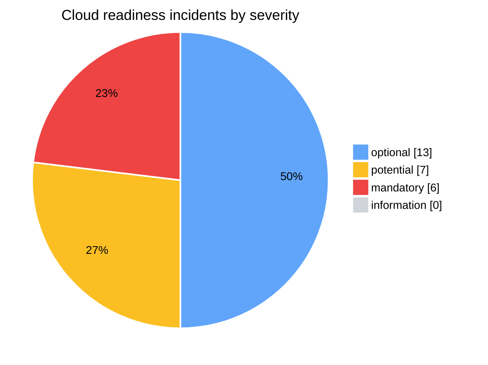
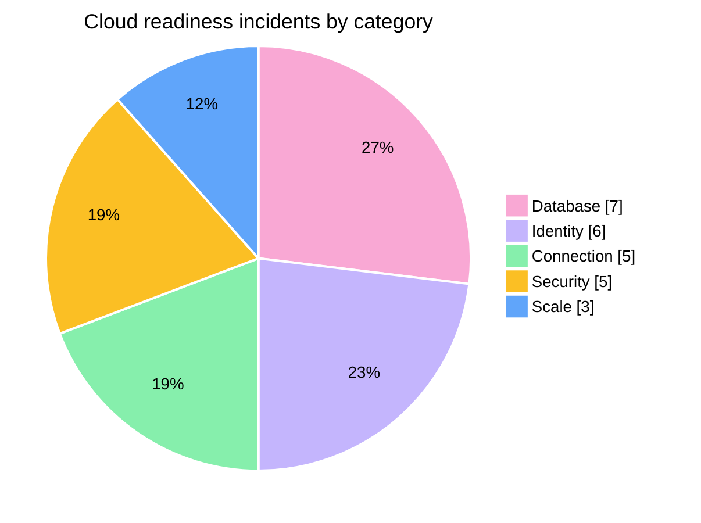
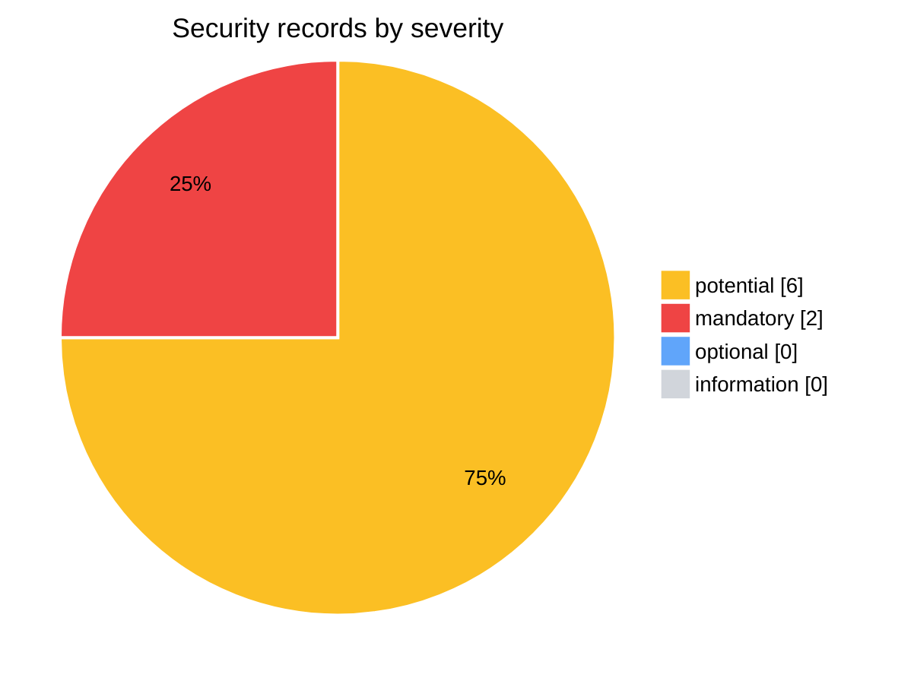
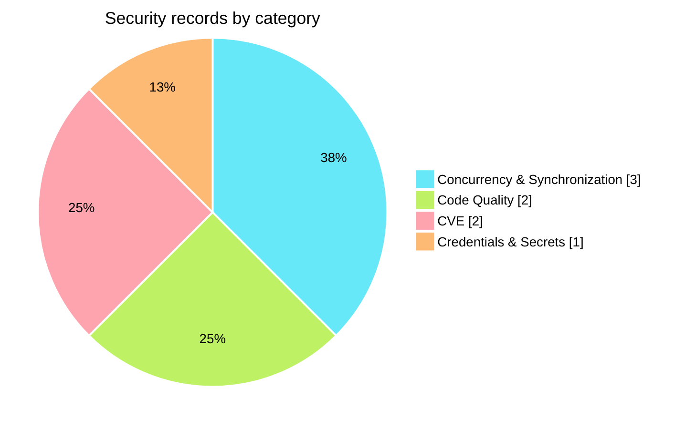
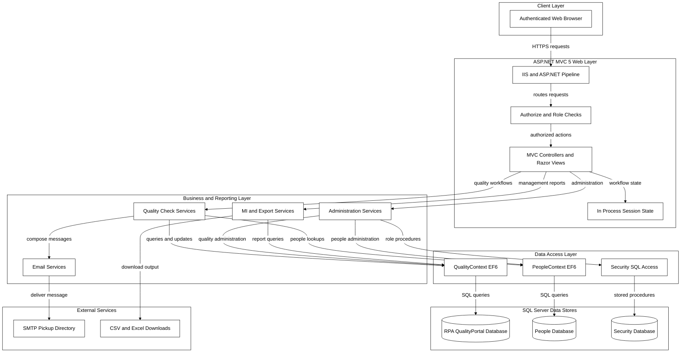
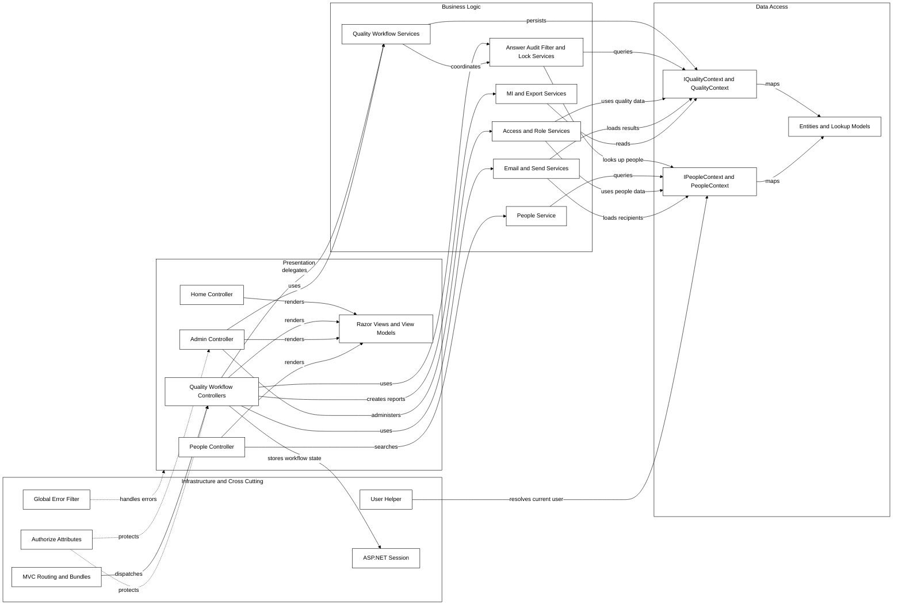
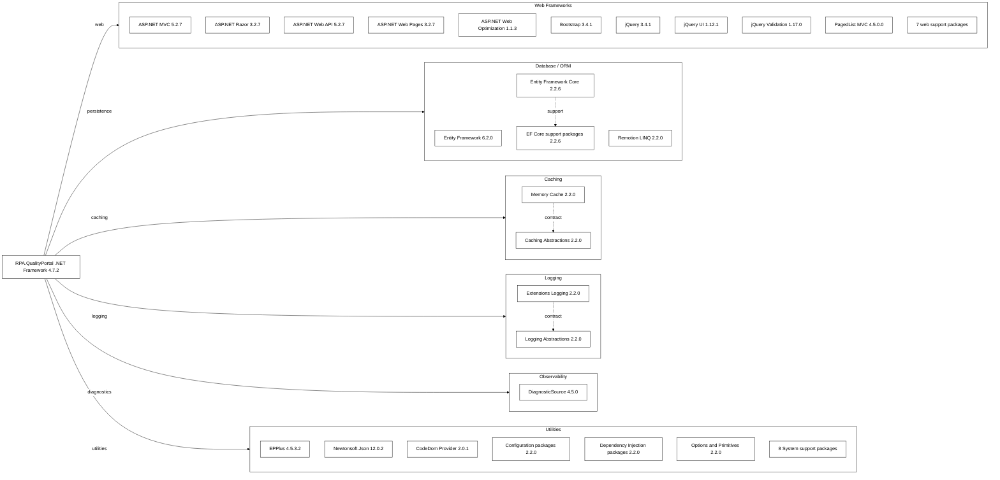
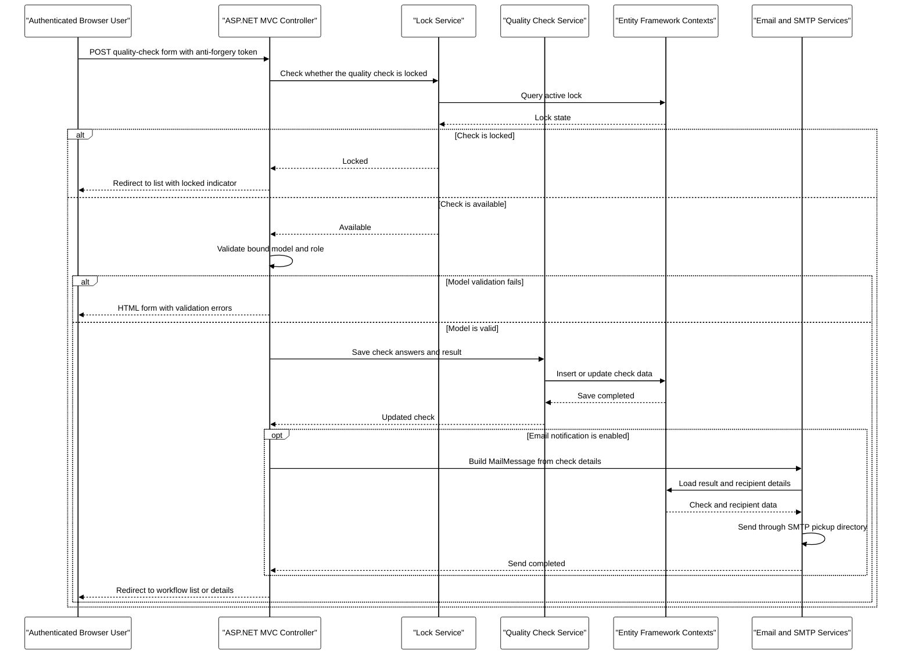
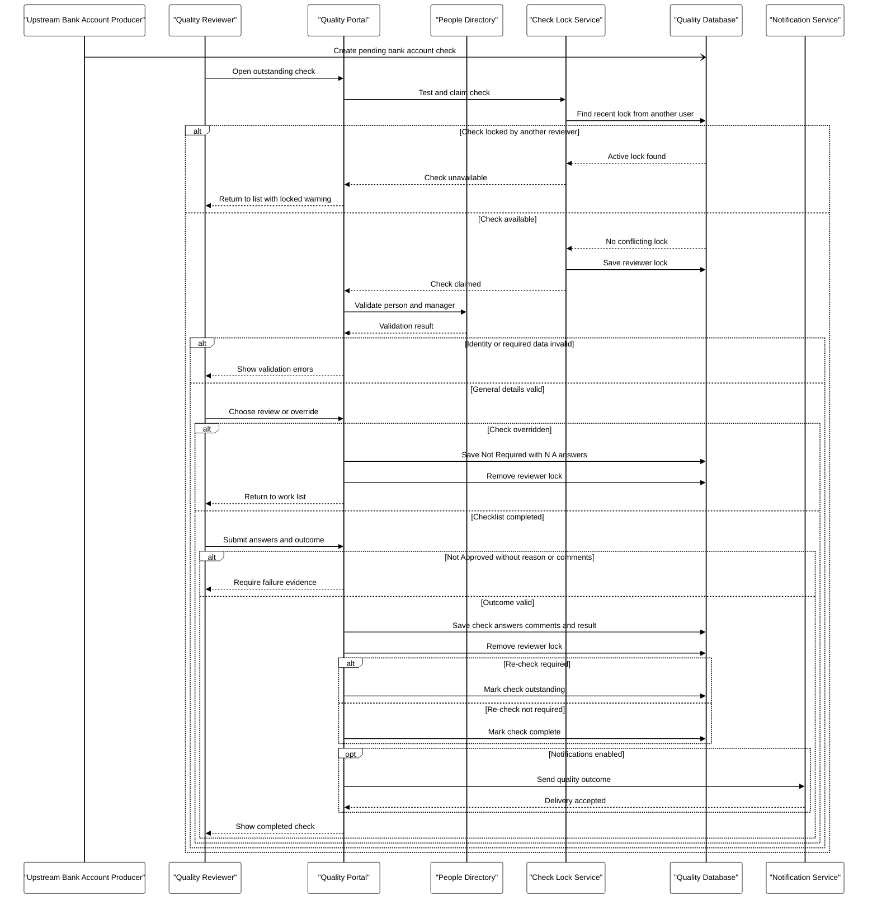

# Report_20261006112031

This is a Markdown rendering of a **historical** App Modernisation assessment of the `RPA.QualityPortal` solution, not a fresh scan. It merges two assessment runs produced by .NET AppCAT CLI on 6 October 2026:

- **Cloud readiness and supporting analysis** from `.github/modernize/assessment/reports/report-20261006111325/` (`report.json`, `solution.json` and the six documents in `facts/`), run in `full` mode.
- **Security findings** from `.github/modernize/assessment/reports/report-20261006112031/` (`report.json`, `solution.json`), run in `issue-only` mode across the `security, cloud-readiness` domains.

The cloud-readiness rules, project records, incidents, summary totals and migration mappings are identical in both runs apart from the internal incident GUIDs, so they are presented once. Internal incident IDs remain in the source folders. Source discrepancies are listed in [Source Notes and Discrepancies](#source-notes-and-discrepancies) rather than silently corrected.

## Contents

1. [Assessment Metadata](#assessment-metadata)
2. [Assessment Summary](#assessment-summary)
3. [Cloud Readiness Findings (Azure Container Apps)](#cloud-readiness-findings-azure-container-apps)
4. [Security Findings](#security-findings)
5. [Migration Solution Mapping](#migration-solution-mapping)
6. [Supporting Analysis and Original Diagrams](#supporting-analysis-and-original-diagrams)
   - [Architecture Diagram](#architecture-diagram)
   - [Dependency Map](#dependency-map)
   - [API & Service Communication Contracts](#api--service-communication-contracts)
   - [Data Architecture & Persistence Layer](#data-architecture--persistence-layer)
   - [Configuration & Externalized Settings Inventory](#configuration--externalized-settings-inventory)
   - [Core Business Workflows](#core-business-workflows)
7. [Source Notes and Discrepancies](#source-notes-and-discrepancies)

## Assessment Metadata

- **Report:** `Report_20261006112031` (ID `20261006112031`), merged with `Report_20261006111325` (ID `20261006111325`)
- **Format / producer:** schema version 1.0.0, .NET AppCAT CLI (both runs)
- **Status / mode:** `20261006112031` completed, `issue-only`; `20261006111325` completed, `full`
- **Analysis window (UTC):** `20261006112031` 2026-10-06T09:20:31.638Z to 2026-10-06T09:24:45.545Z; `20261006111325` 2026-10-06T09:13:25.154Z to 2026-10-06T09:18:27.383Z
- **Privacy:** Protected mode ([privacy mode help](https://aka.ms/appmod-privacy-mode)); same for both runs
- **Target:** Azure Container Apps (`ACA`); same for both runs
- **Domains:** `20261006112031`: security, cloud-readiness; `20261006111325`: cloud-readiness
- **CVE scan:** minimum severity `high`, scope `direct` (both runs)
- **Capabilities:** None specified; **Operating systems:** None specified (both runs)
- **Projects scanned:** `RPA.QualityPortal\RPA.QualityPortal.csproj`, `RPA.QualityPortal.Tests\RPA.QualityPortal.Tests.csproj`

## Assessment Summary

Cloud-readiness values are the source `summary` block (identical in both runs). The source summary does not include security records, so security values are counted from the `security` array of `20261006112031` and kept separate. Effort is in story points.

| Group | Metric | Value |
|---|---|---:|
| Cloud readiness totals | Projects | 2 |
| Cloud readiness totals | Rule types (source `totalIssues`) | 7 |
| Cloud readiness totals | Incidents | 26 |
| Cloud readiness totals | Effort (story points) | 78 |
| Cloud readiness severity (incidents) | mandatory | 6 |
| Cloud readiness severity (incidents) | potential | 7 |
| Cloud readiness severity (incidents) | optional | 13 |
| Cloud readiness severity (incidents) | information | 0 |
| Cloud readiness category (incidents) | Scale | 3 |
| Cloud readiness category (incidents) | Connection | 5 |
| Cloud readiness category (incidents) | Database | 7 |
| Cloud readiness category (incidents) | Identity | 6 |
| Cloud readiness category (incidents) | Security | 5 |
| Security totals | Security records (CWEs and CVEs) | 8 |
| Security totals | CWE records | 6 |
| Security totals | CVE records | 2 |
| Security totals | Effort (story points, sum of records) | 34 |
| Security severity (records) | mandatory | 2 |
| Security severity (records) | potential | 6 |
| Security severity (records) | optional | 0 |
| Security severity (records) | information | 0 |
| Security category (records) | Code Quality | 2 |
| Security category (records) | Concurrency & Synchronization | 3 |
| Security category (records) | Credentials & Secrets | 1 |
| Security category (records) | CVE | 2 |

### Cloud Readiness Charts

Colour key: optional = blue (`#60A5FA`); potential = amber (`#FBBF24`); mandatory = red (`#EF4444`); information = grey (`#D1D5DB`).

Zero-count severities (information) are retained in the data; Mermaid does not draw a slice for them.

Colour key: Database = pink (`#F9A8D4`); Identity = violet (`#C4B5FD`); Connection = green (`#86EFAC`); Security = amber (`#FBBF24`); Scale = blue (`#60A5FA`).

Category colours distinguish rule groups only and do not indicate severity.

### Security Charts

Colour key: potential = amber (`#FBBF24`); mandatory = red (`#EF4444`); optional = blue (`#60A5FA`); information = grey (`#D1D5DB`).

Zero-count severities (optional, information) are retained in the data; Mermaid does not draw a slice for them.

Colour key: Concurrency & Synchronization = cyan (`#67E8F9`); Code Quality = lime (`#BEF264`); CVE = rose (`#FDA4AF`); Credentials & Secrets = orange (`#FDBA74`).

Security category colours distinguish record groups only and do not indicate severity.

## Cloud Readiness Findings (Azure Container Apps)

Severity and effort below are the source ratings for the selected target, Azure Container Apps (`ACA`), unless a table lists all targets. The source incidents carry no line or column numbers; locations are file-level only.

### Project Overview

| Project | App Name | Framework | Language | Build Tool | Rule Types | Incidents | Effort (Story Points) |
|---|---|---|---|---|---:|---:|---:|
| [RPA.QualityPortal&#92;RPA.QualityPortal.csproj](../RPA.QualityPortal/RPA.QualityPortal/RPA.QualityPortal.csproj) | RPA.QualityPortal | .NETFramework,Version=v4.7.2 | C# | MSBuild | 7 | 24 | 72 |
| [RPA.QualityPortal.Tests&#92;RPA.QualityPortal.Tests.csproj](../RPA.QualityPortal/RPA.QualityPortal.Tests/RPA.QualityPortal.Tests.csproj) | RPA.QualityPortal.Tests | .NETFramework,Version=v4.7.2 | C# | MSBuild | 2 | 2 | 6 |

### Findings Overview

| Rule | Title | Severity (ACA) | Effort per Incident (Story Points) | Incidents | Total Effort (Story Points) | Projects |
|---|---|---|---:|---:|---:|---|
| [Scale.0001](#scale0001-static-content-detected) | Static content detected | optional | 3 | 2 | 6 | RPA.QualityPortal, RPA.QualityPortal.Tests |
| [Connection.0001](#connection0001-connection-string-is-detected) | Connection string is detected | potential | 3 | 5 | 15 | RPA.QualityPortal |
| [Database.0002](#database0002-sql-database-connection-detected) | SQL database connection detected | potential | 3 | 1 | 3 | RPA.QualityPortal |
| [Database.0003](#database0003-systemdatasqlclient-dependency-detected) | System.Data.SqlClient dependency detected | optional | 3 | 6 | 18 | RPA.QualityPortal |
| [Identity.0002](#identity0002-windows-authentication-detected) | Windows authentication detected | mandatory | 3 | 6 | 18 | RPA.QualityPortal |
| [Scale.0002](#scale0002-session-state-stored-in-proc-or-in-local-process-is-detected) | Session state stored in-proc or in local process is detected | potential | 3 | 1 | 3 | RPA.QualityPortal |
| [Security.0002](#security0002-connection-strings-without-configuration-builders-detected) | Connection strings without configuration builders detected | optional | 3 | 5 | 15 | RPA.QualityPortal, RPA.QualityPortal.Tests |
| **Total** | | | | **26** | **78** | |

### Rule Guidance and Evidence

#### Scale.0001 Static content detected

| Field | Value |
|---|---|
| Rule severity | optional |
| Rule effort (story points) | 3 |
| Guidance | Static content detected.  Your current approach of serving static content directly might lead to increased costs, performance issues, maintenance challenges (requiring application redeployment for content changes), and security risks.  Consider moving static content to Azure Blob Storage and adding Azure CDN. |
| References | [Azure Blob Storage](https://go.microsoft.com/fwlink/?linkid=2250574) [Azure CDN](https://go.microsoft.com/fwlink/?linkid=2250392) |
| Labels | None specified |
| Migration solution | `local-file-to-azure-blob-storage` |

Target ratings (identical for all 2 incident(s) of this rule):

| Target | Severity | Effort (Story Points) |
|---|---|---:|
| AppService.Windows | optional | 3 |
| AppService.Linux | optional | 3 |
| AKS.Linux | optional | 3 |
| AKS.Windows | optional | 3 |
| **ACA** (selected) | optional | 3 |
| AppServiceContainer.Linux | optional | 3 |
| AppServiceContainer.Windows | optional | 3 |
| AppServiceManagedInstance.Windows | optional | 3 |

| # | Project | Location | Kind | Evidence |
|---:|---|---|---|---|
| 1 | RPA.QualityPortal | [RPA.QualityPortal&#92;RPA.QualityPortal.csproj](../RPA.QualityPortal/RPA.QualityPortal/RPA.QualityPortal.csproj) | File | <code>Found 83 files matching the rule:  Content&#92;bootstrap-theme.css Content&#92;bootstrap-theme.min.css Content&#92;bootstrap.css Content&#92;bootstrap.min.css Content&#92;Images&#92;Checking.jpg Content&#92;Images&#92;Email.jpg Content&#92;Images&#92;inbound.png Content&#92;Images&#92;lock.png Content&#92;Images&#92;Money.jpg Content&#92;Images&#92;outbound.png Content&#92;Site.css Content&#92;themes&#92;base&#92;accordion.css Content&#92;themes&#92;base&#92;all.css Content&#92;themes&#92;base&#92;autocomplete.css Content&#92;themes&#92;base&#92;base.css Content&#92;themes&#92;base&#92;button.css Content&#92;themes&#92;base&#92;core.css Content&#92;themes&#92;base&#92;datepicker.css Content&#92;themes&#92;base&#92;dialog.css Content&#92;themes&#92;base&#92;draggable.css Content&#92;themes&#92;base&#92;images&#92;ui-bg&#95;flat&#95;0&#95;aaaaaa&#95;40x100.png Content&#92;themes&#92;base&#92;images&#92;ui-bg&#95;flat&#95;75&#95;ffffff&#95;40x100.png Content&#92;themes&#92;base&#92;images&#92;ui-bg&#95;glass&#95;55&#95;fbf9ee&#95;1x400.png Content&#92;themes&#92;base&#92;images&#92;ui-bg&#95;glass&#95;65&#95;ffffff&#95;1x400.png Content&#92;themes&#92;base&#92;images&#92;ui-bg&#95;glass&#95;75&#95;dadada&#95;1x400.png Content&#92;themes&#92;base&#92;images&#92;ui-bg&#95;glass&#95;75&#95;e6e6e6&#95;1x400.png Content&#92;themes&#92;base&#92;images&#92;ui-bg&#95;glass&#95;95&#95;fef1ec&#95;1x400.png Content&#92;themes&#92;base&#92;images&#92;ui-bg&#95;highlight-soft&#95;75&#95;cccccc&#95;1x100.png Content&#92;themes&#92;base&#92;images&#92;ui-icons&#95;222222&#95;256x240.png Content&#92;themes&#92;base&#92;images&#92;ui-icons&#95;2e83ff&#95;256x240.png Content&#92;themes&#92;base&#92;images&#92;ui-icons&#95;444444&#95;256x240.png Content&#92;themes&#92;base&#92;images&#92;ui-icons&#95;454545&#95;256x240.png Content&#92;themes&#92;base&#92;images&#92;ui-icons&#95;555555&#95;256x240.png Content&#92;themes&#92;base&#92;images&#92;ui-icons&#95;777620&#95;256x240.png Content&#92;themes&#92;base&#92;images&#92;ui-icons&#95;777777&#95;256x240.png Content&#92;themes&#92;base&#92;images&#92;ui-icons&#95;888888&#95;256x240.png Content&#92;themes&#92;base&#92;images&#92;ui-icons&#95;cc0000&#95;256x240.png Content&#92;themes&#92;base&#92;images&#92;ui-icons&#95;cd0a0a&#95;256x240.png Content&#92;themes&#92;base&#92;images&#92;ui-icons&#95;ffffff&#95;256x240.png Content&#92;themes&#92;base&#92;jquery-ui.css Content&#92;themes&#92;base&#92;jquery-ui.min.css Content&#92;themes&#92;base&#92;menu.css Content&#92;themes&#92;base&#92;progressbar.css Content&#92;themes&#92;base&#92;resizable.css Content&#92;themes&#92;base&#92;selectable.css Content&#92;themes&#92;base&#92;selectmenu.css Content&#92;themes&#92;base&#92;slider.css Content&#92;themes&#92;base&#92;sortable.css Content&#92;themes&#92;base&#92;spinner.css Content&#92;themes&#92;base&#92;tabs.css Content&#92;themes&#92;base&#92;theme.css Content&#92;themes&#92;base&#92;tooltip.css favicon.ico fonts&#92;glyphicons-halflings-regular.eot fonts&#92;glyphicons-halflings-regular.svg fonts&#92;glyphicons-halflings-regular.ttf fonts&#92;glyphicons-halflings-regular.woff fonts&#92;glyphicons-halflings-regular.woff2 Scripts&#92;bootstrap.js Scripts&#92;bootstrap.min.js Scripts&#92;esm&#92;popper-utils.js Scripts&#92;esm&#92;popper-utils.min.js Scripts&#92;esm&#92;popper.js Scripts&#92;esm&#92;popper.min.js Scripts&#92;jquery-3.4.1.js Scripts&#92;jquery-3.4.1.min.js Scripts&#92;jquery-3.4.1.slim.js Scripts&#92;jquery-3.4.1.slim.min.js Scripts&#92;jquery-ui-1.12.1.js Scripts&#92;jquery-ui-1.12.1.min.js Scripts&#92;jquery.validate.js Scripts&#92;jquery.validate.min.js Scripts&#92;jquery.validate.unobtrusive.js Scripts&#92;jquery.validate.unobtrusive.min.js Scripts&#92;modernizr-2.8.3.js Scripts&#92;popper-utils.js Scripts&#92;popper-utils.min.js Scripts&#92;popper.js Scripts&#92;popper.min.js Scripts&#92;umd&#92;popper-utils.js Scripts&#92;umd&#92;popper-utils.min.js Scripts&#92;umd&#92;popper.js Scripts&#92;umd&#92;popper.min.js</code> |
| 2 | RPA.QualityPortal.Tests | [RPA.QualityPortal.Tests&#92;RPA.QualityPortal.Tests.csproj](../RPA.QualityPortal/RPA.QualityPortal.Tests/RPA.QualityPortal.Tests.csproj) | File | <code>Found 1 files matching the rule:  Content&#92;PagedList.css</code> |

#### Connection.0001 Connection string is detected

| Field | Value |
|---|---|
| Rule severity | potential |
| Rule effort (story points) | 3 |
| Guidance | Connection string detected. It may not be available when your app is migrated to Azure.  Review and ensure it works from Azure. If you are connecting to a database, you might need to migrate the database to Azure. There are multiple ways to do it: &nbsp;&nbsp;&nbsp;&nbsp;1. Migrate to Azure SQL Database for additional benefits (see the link below). &nbsp;&nbsp;&nbsp;&nbsp;2. Consider Azure SQL Managed Instance if you need features that are not available in Azure SQL Database and you don’t want to use a VM. &nbsp;&nbsp;&nbsp;&nbsp;3. Migrate your database servers directly to SQL Server on Azure VMs.  To assess database migration effort, you can use Azure Migrate tool, see the link below. |
| References | [Migrate SQL Server database to Azure](https://go.microsoft.com/fwlink/?LinkID=2251731) [Azure SQL Managed Instance](https://go.microsoft.com/fwlink/?LinkID=2251613) [Azure Migrate](https://go.microsoft.com/fwlink/?linkid=2252410) |
| Labels | None specified |
| Migration solution | `plaintext-credential-to-azure-keyvault` |

Target ratings (identical for all 5 incident(s) of this rule):

| Target | Severity | Effort (Story Points) |
|---|---|---:|
| AppService.Windows | potential | 3 |
| AppService.Linux | potential | 3 |
| AKS.Linux | potential | 3 |
| AKS.Windows | potential | 3 |
| **ACA** (selected) | potential | 3 |
| AppServiceContainer.Linux | potential | 3 |
| AppServiceContainer.Windows | potential | 3 |
| AppServiceManagedInstance.Windows | potential | 3 |

| # | Project | Location | Kind | Evidence |
|---:|---|---|---|---|
| 1 | RPA.QualityPortal | [RPA.QualityPortal&#92;Web.config](../RPA.QualityPortal/RPA.QualityPortal/Web.config) | File | <code>&lt;add name="IDTSecurityConnection" /&gt;</code> |
| 2 | RPA.QualityPortal | [RPA.QualityPortal&#92;Web.config](../RPA.QualityPortal/RPA.QualityPortal/Web.config) | File | <code>&lt;add name="QualityContext" /&gt;</code> |
| 3 | RPA.QualityPortal | [RPA.QualityPortal&#92;Web.Production.config](../RPA.QualityPortal/RPA.QualityPortal/Web.Production.config) | File | <code>&lt;add name="QualityContext" /&gt;</code> |
| 4 | RPA.QualityPortal | [RPA.QualityPortal&#92;Web.SIT.config](../RPA.QualityPortal/RPA.QualityPortal/Web.SIT.config) | File | <code>&lt;add name="QualityContext" /&gt;</code> |
| 5 | RPA.QualityPortal | [RPA.QualityPortal&#92;Web.UAT.config](../RPA.QualityPortal/RPA.QualityPortal/Web.UAT.config) | File | <code>&lt;add name="QualityContext" /&gt;</code> |

#### Database.0002 SQL database connection detected

| Field | Value |
|---|---|
| Rule severity | potential |
| Rule effort (story points) | 3 |
| Guidance | SQL database connection detected.  Ensure the database is available/reachable on Azure.  If it is not, there are multiple ways you can move your data to Azure: &nbsp;&nbsp;&nbsp;&nbsp;1. Migrate to Azure SQL Database. &nbsp;&nbsp;&nbsp;&nbsp;2. Consider Azure SQL Managed Instance if you need features that are not available in Azure SQL Database and you don’t want to use a VM. &nbsp;&nbsp;&nbsp;&nbsp;3. Migrate your database servers directly to SQL Server on Azure VMs.  To assess database migration effort, you can use Azure Migrate tool, see the link below. |
| References | [Migrate SQL Server database to Azure](https://go.microsoft.com/fwlink/?LinkID=2251731) [Azure SQL Managed Instance](https://go.microsoft.com/fwlink/?LinkID=2251613) [Azure Migrate](https://go.microsoft.com/fwlink/?linkid=2252410) |
| Labels | None specified |
| Migration solution | `local-sql-server-to-azure-sql-db` |

Target ratings (identical for all 1 incident(s) of this rule):

| Target | Severity | Effort (Story Points) |
|---|---|---:|
| AppService.Windows | potential | 3 |
| AppService.Linux | potential | 3 |
| AKS.Linux | potential | 3 |
| AKS.Windows | potential | 3 |
| **ACA** (selected) | potential | 3 |
| AppServiceContainer.Linux | potential | 3 |
| AppServiceContainer.Windows | potential | 3 |
| AppServiceManagedInstance.Windows | potential | 3 |

| # | Project | Location | Kind | Evidence |
|---:|---|---|---|---|
| 1 | RPA.QualityPortal | [RPA.QualityPortal&#92;Web.config](../RPA.QualityPortal/RPA.QualityPortal/Web.config) | File | <code>&lt;add name="PeopleContext" /&gt;</code> |

#### Database.0003 System.Data.SqlClient dependency detected

| Field | Value |
|---|---|
| Rule severity | optional |
| Rule effort (story points) | 3 |
| Guidance | System.Data.SqlClient dependency is detected.  While System.Data.SqlClient will work in Azure, the newer Microsoft.Data.SqlClient package is the primary .NET SQL client moving forward and receiving the latest features. For example, Microsoft.Data.SqlClient easily allows use of Azure Managed Identity from a connection string. |
| References | [https://go.microsoft.com/fwlink/?LinkID=2242668](https://go.microsoft.com/fwlink/?LinkID=2242668) |
| Labels | None specified |
| Migration solution | `sqlclient-system-to-microsoft` |

Target ratings (identical for all 6 incident(s) of this rule):

| Target | Severity | Effort (Story Points) |
|---|---|---:|
| AppService.Windows | optional | 3 |
| AppService.Linux | optional | 3 |
| AKS.Linux | optional | 3 |
| AKS.Windows | optional | 3 |
| **ACA** (selected) | optional | 3 |
| AppServiceContainer.Linux | optional | 3 |
| AppServiceContainer.Windows | optional | 3 |
| AppServiceManagedInstance.Windows | optional | 3 |

| # | Project | Location | Kind | Evidence |
|---:|---|---|---|---|
| 1 | RPA.QualityPortal | [RPA.QualityPortal&#92;Web.config](../RPA.QualityPortal/RPA.QualityPortal/Web.config) | File | <code>&lt;add name="IDTSecurityConnection" /&gt;</code> |
| 2 | RPA.QualityPortal | [RPA.QualityPortal&#92;Web.config](../RPA.QualityPortal/RPA.QualityPortal/Web.config) | File | <code>&lt;add name="PeopleContext" /&gt;</code> |
| 3 | RPA.QualityPortal | [RPA.QualityPortal&#92;Web.config](../RPA.QualityPortal/RPA.QualityPortal/Web.config) | File | <code>&lt;add name="QualityContext" /&gt;</code> |
| 4 | RPA.QualityPortal | [RPA.QualityPortal&#92;Web.Production.config](../RPA.QualityPortal/RPA.QualityPortal/Web.Production.config) | File | <code>&lt;add name="QualityContext" /&gt;</code> |
| 5 | RPA.QualityPortal | [RPA.QualityPortal&#92;Web.SIT.config](../RPA.QualityPortal/RPA.QualityPortal/Web.SIT.config) | File | <code>&lt;add name="QualityContext" /&gt;</code> |
| 6 | RPA.QualityPortal | [RPA.QualityPortal&#92;Web.UAT.config](../RPA.QualityPortal/RPA.QualityPortal/Web.UAT.config) | File | <code>&lt;add name="QualityContext" /&gt;</code> |

#### Identity.0002 Windows authentication detected

| Field | Value |
|---|---|
| Rule severity | mandatory |
| Rule effort (story points) | 3 |
| Guidance | Your app is using windows authentication which is not supported on Azure App Service, Azure Container Apps and Azure Kubernetes Service.  Azure App Service provides built-in authentication and authorization capabilities, so you can sign in users and access data by writing minimal or no code in your web app.  Follow the link below for more information." |
| References | [https://go.microsoft.com/fwlink/?LinkID=2242883](https://go.microsoft.com/fwlink/?LinkID=2242883) |
| Labels | None specified |
| Migration solution | `windows-ad-to-azure-ad` |

Target ratings (identical for all 6 incident(s) of this rule):

| Target | Severity | Effort (Story Points) |
|---|---|---:|
| AppService.Windows | mandatory | 3 |
| AppService.Linux | mandatory | 3 |
| AKS.Linux | mandatory | 3 |
| AKS.Windows | potential | 3 |
| **ACA** (selected) | mandatory | 3 |
| AppServiceContainer.Linux | mandatory | 3 |
| AppServiceContainer.Windows | mandatory | 3 |
| AppServiceManagedInstance.Windows | mandatory | 3 |

| # | Project | Location | Kind | Evidence |
|---:|---|---|---|---|
| 1 | RPA.QualityPortal | [RPA.QualityPortal&#92;Web.config](../RPA.QualityPortal/RPA.QualityPortal/Web.config) | File | <code>&lt;add name="IDTSecurityConnection" /&gt;</code> |
| 2 | RPA.QualityPortal | [RPA.QualityPortal&#92;Web.config](../RPA.QualityPortal/RPA.QualityPortal/Web.config) | File | <code>&lt;add name="PeopleContext" /&gt;</code> |
| 3 | RPA.QualityPortal | [RPA.QualityPortal&#92;Web.config](../RPA.QualityPortal/RPA.QualityPortal/Web.config) | File | <code>&lt;add name="QualityContext" /&gt;</code> |
| 4 | RPA.QualityPortal | [RPA.QualityPortal&#92;Web.Production.config](../RPA.QualityPortal/RPA.QualityPortal/Web.Production.config) | File | <code>&lt;add name="QualityContext" /&gt;</code> |
| 5 | RPA.QualityPortal | [RPA.QualityPortal&#92;Web.SIT.config](../RPA.QualityPortal/RPA.QualityPortal/Web.SIT.config) | File | <code>&lt;add name="QualityContext" /&gt;</code> |
| 6 | RPA.QualityPortal | [RPA.QualityPortal&#92;Web.UAT.config](../RPA.QualityPortal/RPA.QualityPortal/Web.UAT.config) | File | <code>&lt;add name="QualityContext" /&gt;</code> |

#### Scale.0002 Session state stored in-proc or in local process is detected

| Field | Value |
|---|---|
| Rule severity | potential |
| Rule effort (story points) | 3 |
| Guidance | Session state stored in-proc or in local process is detected.  If you are targeting Managed Instance on Azure App Service, move session to Azure Cache for Redis or Cosmos DB. In-proc session impedes scale-out; Managed Instance does not change session semantics.  While if targeting other Azure compute services:  In-proc or local process stored session state not immediately prevents an application from working in Azure, however, is not recommended because it would make scaling the Azure App Service or Azure Kubernetes Service more difficult.  Azure provides multiple ways to store session state in a scalable way using Azure Cache for Redis, Azure Cosmos DB or other services. |
| References | [ASP.NET Session State Provider for Azure Cache for Redis](https://go.microsoft.com/fwlink/?linkid=2250855) [Use Azure Cosmos DB as an ASP.NET session state and caching provider](https://go.microsoft.com/fwlink/?linkid=2250757) [Azure Cosmos DB: autoscale, session state, monitoring, and more](https://go.microsoft.com/fwlink/?linkid=2250758) [Design to scale out](https://go.microsoft.com/fwlink/?linkid=2251007) |
| Labels | None specified |
| Migration solution | `session-state-prompt` |

Target ratings (identical for all 1 incident(s) of this rule):

| Target | Severity | Effort (Story Points) |
|---|---|---:|
| AppService.Windows | potential | 3 |
| AppService.Linux | potential | 3 |
| AKS.Linux | potential | 3 |
| AKS.Windows | potential | 3 |
| **ACA** (selected) | potential | 3 |
| AppServiceContainer.Linux | potential | 3 |
| AppServiceContainer.Windows | potential | 3 |
| AppServiceManagedInstance.Windows | potential | 3 |

| # | Project | Location | Kind | Evidence |
|---:|---|---|---|---|
| 1 | RPA.QualityPortal | [RPA.QualityPortal&#92;Web.config](../RPA.QualityPortal/RPA.QualityPortal/Web.config) | File | <code>&lt;sessionState /&gt;</code> |

#### Security.0002 Connection strings without configuration builders detected

| Field | Value |
|---|---|
| Rule severity | optional |
| Rule effort (story points) | 3 |
| Guidance | Connection strings without configuration builders detected.    &nbsp;Keeping connection strings directly in the app is not the best practice and might introduce security risks, increased maintenance, scalability challenges or compliance standards (such as PCI DSS, GDPR, etc.).   &nbsp;Instead, it is recommended to use configuration builders to get secrets from secure sources in Azure environment. |
| References | [Configuration builders](https://go.microsoft.com/fwlink/?LinkID=2250915) [Storing application secrets](https://go.microsoft.com/fwlink/?LinkID=2250916) [Centralized app configuration and security](https://go.microsoft.com/fwlink/?LinkID=2250733) |
| Labels | None specified |
| Migration solution | `plaintext-credential-to-azure-keyvault` |

Target ratings (identical for all 5 incident(s) of this rule):

| Target | Severity | Effort (Story Points) |
|---|---|---:|
| AppService.Windows | optional | 3 |
| AppService.Linux | optional | 3 |
| AKS.Linux | optional | 3 |
| AKS.Windows | optional | 3 |
| **ACA** (selected) | optional | 3 |
| AppServiceContainer.Linux | optional | 3 |
| AppServiceContainer.Windows | optional | 3 |
| AppServiceManagedInstance.Windows | optional | 3 |

| # | Project | Location | Kind | Evidence |
|---:|---|---|---|---|
| 1 | RPA.QualityPortal | [RPA.QualityPortal&#92;Web.config](../RPA.QualityPortal/RPA.QualityPortal/Web.config) | File | <code>&lt;connectionStrings /&gt;</code> |
| 2 | RPA.QualityPortal | [RPA.QualityPortal&#92;Web.Production.config](../RPA.QualityPortal/RPA.QualityPortal/Web.Production.config) | File | <code>&lt;connectionStrings /&gt;</code> |
| 3 | RPA.QualityPortal | [RPA.QualityPortal&#92;Web.SIT.config](../RPA.QualityPortal/RPA.QualityPortal/Web.SIT.config) | File | <code>&lt;connectionStrings /&gt;</code> |
| 4 | RPA.QualityPortal | [RPA.QualityPortal&#92;Web.UAT.config](../RPA.QualityPortal/RPA.QualityPortal/Web.UAT.config) | File | <code>&lt;connectionStrings /&gt;</code> |
| 5 | RPA.QualityPortal.Tests | [RPA.QualityPortal.Tests&#92;App.config](../RPA.QualityPortal/RPA.QualityPortal.Tests/App.config) | File | <code>&lt;connectionStrings /&gt;</code> |

## Security Findings

Source: `report-20261006112031/report.json` (`security` array, 8 records). **Severity** is the assessment's own rating (`mandatory`/`potential`); CVE advisory severities (CVSS/GitHub advisory, e.g. `HIGH`) are reported separately below and are not the same scale. File paths are shown exactly as supplied (the source mixes `\` and `/` separators); links resolve them against the repository root.

| ID | Title | Category | Severity | Description | Files | Evidence | Effort (Story Points) |
|---|---|---|---|---|---|---|---:|
| CWE-772 | Missing Release of Resource after Effective Lifetime | Code Quality | potential | The product does not release a resource after its effective lifetime has ended, i.e., after the resource is no longer needed. | [RPA.QualityPortal&#92;RPA.QualityPortal&#92;Services&#92;SendService.cs](../RPA.QualityPortal/RPA.QualityPortal/Services/SendService.cs) | SendService.sendEmail creates an SmtpClient at line 14 and calls Send at line 15 without disposing the client, leaving its network resources unreleased after the operation. | 3 |
| CWE-1057 | Data Access Operations Outside of Expected Data Manager Component | Code Quality | potential | The product uses a dedicated, central data manager component as required by design, but it contains code that performs data-access operations that do not use this data manager. | [RPA.QualityPortal&#92;RPA.QualityPortal&#92;Controllers&#92;PeopleController.cs](../RPA.QualityPortal/RPA.QualityPortal/Controllers/PeopleController.cs) [RPA.QualityPortal&#92;RPA.QualityPortal&#92;Controllers&#92;AdminController.cs](../RPA.QualityPortal/RPA.QualityPortal/Controllers/AdminController.cs) [RPA.QualityPortal&#92;RPA.QualityPortal&#92;Controllers&#92;BankAccount&#92;BankAccountReCheckController.cs](../RPA.QualityPortal/RPA.QualityPortal/Controllers/BankAccount/BankAccountReCheckController.cs) [RPA.QualityPortal&#92;RPA.QualityPortal&#92;Controllers&#92;BankAccount&#92;BankAccountController.cs](../RPA.QualityPortal/RPA.QualityPortal/Controllers/BankAccount/BankAccountController.cs) [RPA.QualityPortal&#92;RPA.QualityPortal&#92;Controllers&#92;OutboundCorrespondence&#92;OutboundCorrespondenceAccreditationController.cs](../RPA.QualityPortal/RPA.QualityPortal/Controllers/OutboundCorrespondence/OutboundCorrespondenceAccreditationController.cs) [RPA.QualityPortal&#92;RPA.QualityPortal&#92;Controllers&#92;OutboundCorrespondence&#92;OutboundCorrespondenceController.cs](../RPA.QualityPortal/RPA.QualityPortal/Controllers/OutboundCorrespondence/OutboundCorrespondenceController.cs) [RPA.QualityPortal&#92;RPA.QualityPortal&#92;Controllers&#92;OutboundCorrespondence&#92;OutboundCorrespondenceMIController.cs](../RPA.QualityPortal/RPA.QualityPortal/Controllers/OutboundCorrespondence/OutboundCorrespondenceMIController.cs) [RPA.QualityPortal&#92;RPA.QualityPortal&#92;Controllers&#92;OutboundCorrespondence&#92;OutboundCorrespondenceReCheckController.cs](../RPA.QualityPortal/RPA.QualityPortal/Controllers/OutboundCorrespondence/OutboundCorrespondenceReCheckController.cs) | MVC controller classes perform Entity Framework data access directly instead of delegating it to the DAL/service layer. For example, PeopleController.PeopleSearch queries pdb.People at lines 31-42, and the other listed controllers similarly query or mutate db/pdb contexts directly from controller actions. | 5 |
| CWE-567 | Unsynchronized Access to Shared Data in a Multithreaded Context | Concurrency &amp; Synchronization | potential | The product does not properly synchronize shared data, such as static variables across threads, which can lead to undefined behavior and unpredictable data changes. | [RPA.QualityPortal/RPA.QualityPortal/Factory/HttpContextManager.cs](../RPA.QualityPortal/RPA.QualityPortal/Factory/HttpContextManager.cs) | HttpContextManager exposes the process-wide mutable static field mContext through Current and SetCurrentContext() without synchronization (field at line 12, read at lines 17-18, write at line 29), allowing concurrent ASP.NET requests or tests to race on shared context state. | 5 |
| CWE-662 | Improper Synchronization | Concurrency &amp; Synchronization | potential | The product utilizes multiple threads or processes to allow temporary access to a shared resource that can only be exclusive to one process at a time, but it does not properly synchronize these actions, which might cause simultaneous accesses of this resource by multiple threads or processes. | [RPA.QualityPortal/RPA.QualityPortal/Factory/HttpContextManager.cs](../RPA.QualityPortal/RPA.QualityPortal/Factory/HttpContextManager.cs) | HttpContextManager.Current and SetCurrentContext() access the shared static mContext field without synchronization (read at lines 17-18 and write at line 29), so concurrent callers can simultaneously access and replace the shared resource. | 8 |
| CWE-820 | Missing Synchronization | Concurrency &amp; Synchronization | potential | The product utilizes a shared resource in a concurrent manner but does not attempt to synchronize access to the resource. | [RPA.QualityPortal/RPA.QualityPortal/Factory/HttpContextManager.cs](../RPA.QualityPortal/RPA.QualityPortal/Factory/HttpContextManager.cs) | HttpContextManager stores request context in mutable static field mContext (line 12), but Current reads it and SetCurrentContext() writes it with no locking, interlocked operation, volatile declaration, or other synchronization. | 8 |
| CWE-778 | Insufficient Logging | Credentials &amp; Secrets | potential | When a security-critical event occurs, the product either does not record the event or omits important details about the event when logging it. | [RPA.QualityPortal/RPA.QualityPortal/Controllers/AdminController.cs](../RPA.QualityPortal/RPA.QualityPortal/Controllers/AdminController.cs) [RPA.QualityPortal/RPA.QualityPortal/App&#95;Start/FilterConfig.cs](../RPA.QualityPortal/RPA.QualityPortal/App_Start/FilterConfig.cs) | AdminController is protected by a role-based Authorize attribute at line 17, but FilterConfig.RegisterGlobalFilters() at line 13 registers only HandleErrorAttribute and no authorization/audit logging filter, so failed access to this security-critical administrative endpoint is not recorded. | 3 |
| CVE-2021-21252 | Regular Expression Denial of Service in jquery-validation | CVE | mandatory | [CVE-2021-21252](https://github.com/advisories/GHSA-jxwx-85vp-gvwm): Regular Expression Denial of Service in jquery-validation  Severity: HIGH  Affected dependencies: &nbsp;&nbsp;- jQuery.Validation@1.17.0 (declared at RPA.QualityPortal&#92;RPA.QualityPortal&#92;packages.config:9)  Recommended fix: &nbsp;&nbsp;- Upgrade jquery-validation to 1.19.3 or later &nbsp;&nbsp;- Upgrade jQuery.Validation to 1.19.3 or later | [RPA.QualityPortal&#92;RPA.QualityPortal&#92;packages.config:9](../RPA.QualityPortal/RPA.QualityPortal/packages.config#L9) | _Source explanation is empty; see description._ | 1 |
| CVE-2024-21907 | Improper Handling of Exceptional Conditions in Newtonsoft.Json | CVE | mandatory | [CVE-2024-21907](https://github.com/advisories/GHSA-5crp-9r3c-p9vr): Improper Handling of Exceptional Conditions in Newtonsoft.Json  Severity: HIGH  Affected dependencies: &nbsp;&nbsp;- Newtonsoft.Json@12.0.2 (declared at RPA.QualityPortal&#92;RPA.QualityPortal&#92;packages.config:34, RPA.QualityPortal&#92;RPA.QualityPortal.Tests&#92;packages.config:14)  Recommended fix: &nbsp;&nbsp;- Upgrade Newtonsoft.Json to 13.0.1 or later | [RPA.QualityPortal&#92;RPA.QualityPortal&#92;packages.config:34](../RPA.QualityPortal/RPA.QualityPortal/packages.config#L34) [RPA.QualityPortal&#92;RPA.QualityPortal.Tests&#92;packages.config:14](../RPA.QualityPortal/RPA.QualityPortal.Tests/packages.config#L14) | _Source explanation is empty; see description._ | 1 |
| **Total** | | | | | | | **34** |

### CVE Advisory Details

Parsed from the CVE record descriptions above; advisory severity is the source advisory text, distinct from the assessment severity.

| CVE | Advisory | Assessment Severity | Advisory Severity | Affected Dependency | Declared At | Recommended Fix |
|---|---|---|---|---|---|---|
| CVE-2021-21252 | [https://github.com/advisories/GHSA-jxwx-85vp-gvwm](https://github.com/advisories/GHSA-jxwx-85vp-gvwm) | mandatory | HIGH | jQuery.Validation@1.17.0 | RPA.QualityPortal&#92;RPA.QualityPortal&#92;packages.config:9 | Upgrade jquery-validation to 1.19.3 or later Upgrade jQuery.Validation to 1.19.3 or later |
| CVE-2024-21907 | [https://github.com/advisories/GHSA-5crp-9r3c-p9vr](https://github.com/advisories/GHSA-5crp-9r3c-p9vr) | mandatory | HIGH | Newtonsoft.Json@12.0.2 | RPA.QualityPortal&#92;RPA.QualityPortal&#92;packages.config:34, RPA.QualityPortal&#92;RPA.QualityPortal.Tests&#92;packages.config:14 | Upgrade Newtonsoft.Json to 13.0.1 or later |

## Migration Solution Mapping

`solution.json` is identical in both source folders (7 mappings). The source supplies no mapping for security records.

| Rule | Migration Solution |
|---|---|
| Scale.0001 | `local-file-to-azure-blob-storage` |
| Connection.0001 | `plaintext-credential-to-azure-keyvault` |
| Security.0002 | `plaintext-credential-to-azure-keyvault` |
| Database.0002 | `local-sql-server-to-azure-sql-db` |
| Database.0003 | `sqlclient-system-to-microsoft` |
| Identity.0002 | `windows-ad-to-azure-ad` |
| Scale.0002 | `session-state-prompt` |

## Supporting Analysis and Original Diagrams

The following documents are reproduced from `report-20261006111325/facts/` (the `20261006112031` issue-only run produced no `facts/` folder). Content, tables, code and diagram nodes/relationships are unchanged; styling has been normalised: headings are demoted two levels to fit this report, and each Mermaid diagram has an explicit black-and-white `theme: base` / `look: classic` configuration added. No Mermaid syntax repairs were needed.

Source: `facts/architecture-diagram.md`

### Architecture Diagram

RPA Quality Portal is a server-rendered ASP.NET MVC 5 application for quality-check workflows, administration, management information, and reporting. It uses service classes over Entity Framework 6 contexts, with SQL Server-backed quality, people, and security data.

#### Application Architecture

<!-- mermaid-checked: no \n, no em-dash/en-dash, no {} in labels, subgraphs are id["label"], arrows are -->|"label"|, all subgraphs closed by end, ids unique -->

##### Technology Stack Summary

| Layer | Technology | Version | Purpose |
|---|---|---:|---|
| Runtime | .NET Framework | 4.7.2 | Hosts the web application and supporting class library code |
| Presentation | ASP.NET MVC | 5.2.7 | Routes requests to controllers and renders Razor views |
| Client | Bootstrap, jQuery, jQuery UI | 3.4.1, 3.4.1, 1.12.1 | Provides browser layout, interaction, and validation support |
| Business logic | C# service and helper classes | Project-defined | Implements quality checks, rechecks, filtering, locking, audit, administration, email, and reporting |
| Data access | Entity Framework 6 | 6.2.0 | Maps quality and people entities through `QualityContext` and `PeopleContext` |
| Security data access | ADO.NET and ASP.NET providers | .NET Framework | Executes security stored procedures and supplies membership, profile, and role data |
| Reporting | EPPlus and delimited text generation | 4.5.3.2 | Produces spreadsheet and CSV downloads |
| Messaging | `System.Net.Mail` SMTP | .NET Framework | Builds and delivers quality-result notifications through a configured pickup directory |
| State | ASP.NET in-process session | .NET Framework | Retains multi-step quality-check workflow state |
| Testing | MSTest project with mock contexts | Project-defined | Exercises controllers and services without production databases |

##### Data Storage & External Services

The application uses three SQL Server databases. `QualityContext` stores quality checks, questions, answers, results, audits, locks, rechecks, and lookup data in the RPA QualityPortal database; `PeopleContext` reads people, manager, and location information from the People database; ASP.NET membership and role providers plus `AccessService` use the Security database. Email is handed to a configured SMTP pickup directory, while management information is returned directly to users as CSV or Excel downloads. No distributed cache or message broker is present; workflow state is kept in the IIS worker process.

##### Key Architectural Decisions

- Uses classic MVC separation with Razor views, controller-led orchestration, service interfaces, and EF6 context interfaces that support mock-based tests.
- Production controllers manually compose concrete contexts, helpers, and services in parameterless constructors, while alternate constructors accept interfaces for testing.
- Separates quality, people, and security persistence, combining EF6 for domain data with direct ADO.NET stored-procedure calls and ASP.NET membership and role providers for access control.

#### Component Relationships

<!-- mermaid-checked: no \n, no em-dash/en-dash, no {} in labels, subgraphs are id["label"], arrows are -->|"label"|, all subgraphs closed by end, ids unique -->

##### Component Inventory

| Component | Layer | Type | Responsibility |
|---|---|---|---|
| HomeController | Presentation | MVC controller | Presents the secured portal landing page |
| BankAccountController and BankAccountReCheckController | Presentation | MVC controllers | Run bank-account quality checks, rechecks, exports, notifications, and multi-step session workflows |
| OutboundCorrespondence controllers | Presentation | MVC controllers | Run correspondence quality checks, rechecks, filtering, MI views, exports, and notifications |
| AdminController | Presentation | MVC controller | Manages locks, access, quality data, and administrative workflows |
| PeopleController | Presentation | MVC controller | Provides people-search interactions |
| Razor views and view models | Presentation | Views and DTOs | Render forms, lists, details, MI results, and workflow-specific data |
| BankAccountService | Business logic | Domain service | Saves bank-account checks and rechecks and calculates persisted results |
| OutboundCorrespondenceService | Business logic | Domain service | Applies correspondence quality rules and persists checks, rechecks, challenges, and results |
| AnswerService | Business logic | Supporting service | Creates and updates answers and comments for quality checks |
| FilterService | Business logic | Query service | Builds role-aware and user-aware quality-check filters |
| LockService | Business logic | Coordination service | Creates, checks, and removes edit locks |
| AuditService | Business logic | Audit service | Records quality-check audit information |
| PeopleService | Business logic | Query service | Retrieves people and reporting-line information |
| AccessService and RoleManager | Business logic | Security services | Check roles and perform security-role changes |
| EmailService and SendService | Business logic | Messaging services | Build result emails and submit them through SMTP |
| MIService and ExportService | Business logic | Reporting services | Aggregate management information and generate downloadable reports |
| QualityContext and IQualityContext | Data access | EF6 context and abstraction | Map and persist quality-domain entities |
| PeopleContext and IPeopleContext | Data access | EF6 context and abstraction | Read people, manager, and location entities |
| Domain and lookup models | Data access | EF entities | Represent checks, rechecks, answers, results, people, locks, audits, and reference data |
| UserHelper | Infrastructure | Request helper | Maps the authenticated Windows identity to a person record |
| Authorize attributes | Cross-cutting | MVC authorization filter | Restrict controllers and actions by quality-check roles |
| HandleErrorAttribute | Cross-cutting | Global MVC filter | Applies default MVC error handling |
| RouteConfig and BundleConfig | Infrastructure | Application configuration | Configure conventional routing and static asset bundles |
| ASP.NET Session | Infrastructure | In-process state | Carries check data between multi-step controller actions |

Source: `facts/dependency-map.md`

### Dependency Map

RPA.QualityPortal declares 47 application dependencies across its .NET Framework 4.7.2 web project. The solution also declares 8 test-specific dependencies in the separate test project.

#### Dependencies

<!-- mermaid-checked: no \n, no em-dash/en-dash, no {} in labels, subgraphs are id["label"], arrows are -->|"label"|, all subgraphs closed by end, ids unique -->

##### Dependency Summary

| Category | Count | Key Libraries | Notes |
|---|---:|---|---|
| Web Frameworks | 18 | ASP.NET MVC 5.2.7, ASP.NET Web API 5.2.7, Bootstrap 3.4.1, jQuery 3.4.1 | Legacy System.Web MVC stack with client-side packages managed through NuGet |
| Database / ORM | 5 | Entity Framework 6.2.0, Entity Framework Core 2.2.6, Remotion.Linq 2.2.0 | Two Entity Framework generations are declared together |
| Caching | 2 | Microsoft.Extensions.Caching.Memory 2.2.0 | Microsoft.Extensions 2.2 caching abstractions and implementation |
| Logging | 2 | Microsoft.Extensions.Logging 2.2.0 | Logging API and abstractions are declared; no concrete logging provider is listed |
| Observability | 1 | System.Diagnostics.DiagnosticSource 4.5.0 | Diagnostic primitives only; no telemetry exporter or APM package is declared |
| Utilities | 19 | EPPlus 4.5.3.2, Newtonsoft.Json 12.0.2, Microsoft.Extensions.Configuration 2.2.0 | Includes compiler support, configuration, dependency injection, and System compatibility packages |

All application packages are declared through `packages.config`; that format does not encode NuGet dependency scope. They are therefore treated as application compile/runtime dependencies. No parent package, BOM, central package management file, or lock file was detected.

##### Version & Compatibility Risks

The application targets .NET Framework 4.7.2 and the legacy ASP.NET MVC 5/System.Web stack, which require a substantial migration for ASP.NET Core. Entity Framework Core 2.2 and Microsoft.Extensions 2.2 are out of support, while Entity Framework 6.2 predates later .NET Framework and .NET modernization improvements. Bootstrap 3, Modernizr 2.8.3, jQuery UI 1.12.1, Newtonsoft.Json 12.0.2, and EPPlus 4.5.3.2 are also old major or minor lines and should be compatibility- and security-reviewed before modernization.

##### Notable Observations

- Entity Framework 6.2.0 and Entity Framework Core 2.2.6 coexist, increasing persistence-layer migration complexity and the risk of inconsistent data-access patterns.
- The dependency graph mixes legacy `packages.config` management with Microsoft.Extensions 2.2 libraries; there is no lock file or central version-management mechanism.
- No security, authentication, messaging, or concrete observability/exporter package is declared in the application package manifest.
- Front-end libraries are delivered as NuGet packages, which is a legacy asset-management approach compared with current npm-based tooling.

#### Test Dependencies

| Framework | Version | Notes |
|---|---|---|
| NUnit | 3.12.0 | Primary unit-test framework |
| NUnit3TestAdapter | 3.15.1 | Visual Studio test discovery adapter |
| Moq | 4.13.0 | Mocking framework |
| Rhino Mocks | 3.6 | Legacy mocking framework used alongside Moq |
| Castle.Core | 4.4.0 | Proxy infrastructure supporting test doubles |
| EntityFrameworkTesting | 1.2.3 | Entity Framework test support |
| EntityFrameworkTesting.Moq | 1.2.3 | Moq integration for Entity Framework tests |
| MvcContrib.Mvc3.TestHelper-ci | 3.0.100.0 | Legacy MVC 3-era controller test helper |

Total test-scope dependencies: 8

The test project uses an outdated NUnit adapter and multiple generations of mocking/test-helper libraries. No dedicated integration-test, contract-test, browser-test, or containerized test infrastructure dependency was detected.

Source: `facts/api-service-contracts.md`

### API & Service Communication Contracts

The application exposes more than 70 conventional ASP.NET MVC actions from one deployable web application, primarily serving HTML views, partial views, redirects, CSV downloads, and one JSON people-search response. Communication is synchronous: controllers call in-process services and Entity Framework contexts, while notification workflows hand messages to an SMTP pickup directory.

#### Service Catalog

| Service | Port | Category | Purpose |
|---|---:|---|---|
| RPA.QualityPortal | 44359 (local IIS Express HTTPS); 57885 (development server setting) | Business | Hosts the quality-check user interface and workflows for outbound correspondence, bank-account checks, rechecks, challenges, administration, accreditation, management information, people lookup, exports, and email notifications. Key dependencies are ASP.NET MVC 5.2.7, .NET Framework 4.7.2, Entity Framework 6, Newtonsoft.Json, PagedList.Mvc, EPPlus, and the IDT security/role provider. |

The solution also contains `RPA.QualityPortal.Tests`, which is a test project rather than an independently deployable service. No Docker Compose service, Kubernetes deployment, Helm chart, or additional source-built runtime service was found.

#### API Endpoints Inventory

Routes use the conventional `/{controller}/{action}/{id}` template. Actions without an explicit HTTP attribute accept GET by convention; overloaded mutation actions are marked POST. Because the application has more than 30 actions, related actions are grouped by controller and workflow.

| Service / Controller | Method | Path | Request Type | Response Type |
|---|---|---|---|---|
| RPA.QualityPortal / HomeController | GET | `/Home/Index` | None | HTML `ViewResult` |
| RPA.QualityPortal / PeopleController | GET | `/People/PeopleSearch?searchstring={value}` | Query string `searchstring` | JSON array of mutable `PeopleSearchModel`; HTTP 200 content response |
| RPA.QualityPortal / OutboundCorrespondenceController | GET | `/OutboundCorrespondence/{Index\|Complete\|Outstanding}` | Query parameters for lock state, search, page, page size, and filter | HTML list view with paged `OutboundCorrespondenceOverview` data |
| RPA.QualityPortal / OutboundCorrespondenceController | GET | `/OutboundCorrespondence/{Export\|ExportArchive}` | None | CSV `FileResult`; HTTP 200 |
| RPA.QualityPortal / OutboundCorrespondenceController | GET, POST | `/OutboundCorrespondence/{CreateGeneral\|CreateQuestions\|CreateResult}` | Query/path state plus form-bound `OutboundCorrespondence` or `QuestionAnswerList`; anti-forgery token on POST | HTML view on validation failure or redirect on success |
| RPA.QualityPortal / OutboundCorrespondenceController | GET, POST | `/OutboundCorrespondence/{EditGeneral\|EditQuestions\|EditResult\|AmendmentReason}` | `CheckId` or session state on GET; form-bound `OutboundCorrespondence`, `QuestionAnswerList`, or `CheckAmendmentReason` on POST | HTML view or redirect |
| RPA.QualityPortal / OutboundCorrespondenceController | GET, POST | `/OutboundCorrespondence/{Challenge\|ChallengeQuestions\|ChallengeResult\|ChallengeAmendmentReason}` | `CheckId`, `Challenge`, `QuestionAnswerList`, `OutboundCorrespondence`, or `CheckAmendmentReason` | HTML/partial view or redirect |
| RPA.QualityPortal / OutboundCorrespondenceController | GET | `/OutboundCorrespondence/{GeneralDetails\|Details\|_ReCheckResults\|_ChallengeView}` | `CheckId` | HTML view or partial view using detail/overview models |
| RPA.QualityPortal / OutboundCorrespondenceController | GET, POST | `/OutboundCorrespondence/{DeleteView\|Delete}` | `CheckId`; anti-forgery-protected POST for deletion | Confirmation view or redirect |
| RPA.QualityPortal / OutboundCorrespondenceReCheckController | GET, POST | `/OutboundCorrespondenceReCheck/{CreateReCheckQuestions\|CreateReCheckResult}` | `CheckId`, `QuestionAnswerList`, or `OutboundCorrespondenceReCheck` | HTML/partial view or redirect |
| RPA.QualityPortal / OutboundCorrespondenceReCheckController | GET | `/OutboundCorrespondenceReCheck/{DetailsReCheck\|DetailsReChecks\|_CheckAnswer}` | `CheckId` and optionally `QuestionId` | HTML view or partial view |
| RPA.QualityPortal / OutboundCorrespondenceReCheckController | GET, POST | `/OutboundCorrespondenceReCheck/{EditReCheckQuestions\|EditReCheckResult\|AmendmentReasonReCheck}` | `ReCheckId`, `QuestionAnswerList`, `OutboundCorrespondenceReCheck`, or `CheckAmendmentReason` | HTML view or redirect |
| RPA.QualityPortal / OutboundCorrespondenceReCheckController | GET, POST | `/OutboundCorrespondenceReCheck/{DeleteReCheckView\|DeleteReCheck}` | `CheckId`; POST performs deletion | Confirmation view or redirect |
| RPA.QualityPortal / OutboundCorrespondenceAccreditationController | GET | `/OutboundCorrespondenceAccreditation/{AccreditationIndex\|Accredit\|UserConsecutivePasses}` | Paging values or `accreditationId` | HTML view |
| RPA.QualityPortal / OutboundCorrespondenceAccreditationController | GET | `/OutboundCorrespondenceAccreditation/Export` | None | Spreadsheet/file download |
| RPA.QualityPortal / OutboundCorrespondenceAccreditationController | GET | `/OutboundCorrespondenceAccreditation/{ManualRefreshBulk\|ManualRefreshIndividual}` | Optional person `name` | Redirect or HTML response after refresh |
| RPA.QualityPortal / OutboundCorrespondenceMIController | GET | `/OutboundCorrespondenceMI/{MIIndex\|_OutboundCorrespondenceMI}` | Search, search option, date range, scheme, business area, correspondence type, and back-navigation query parameters | HTML view or partial view using MI view models |
| RPA.QualityPortal / OutboundCorrespondenceMIController | GET | `/OutboundCorrespondenceMI/{_AnswerMI\|MIDetails}` | Optional `personName` and `detailsClick` | HTML partial/detail view |
| RPA.QualityPortal / BankAccountController | GET | `/BankAccount/{Index\|Complete\|Outstanding}` | Lock, search, date range, paging, and coaching-point query parameters | HTML list view with paged `BankAccountOverview` data |
| RPA.QualityPortal / BankAccountController | GET | `/BankAccount/Export` | None | CSV `FileResult`; HTTP 200 |
| RPA.QualityPortal / BankAccountController | GET, POST | `/BankAccount/{CreateGeneral\|CreateQuestions\|CreateResult}` | `CheckId`, form-bound `BankAccountCheck`, `QuestionAnswerList`, and result value | HTML view on validation failure or redirect on success |
| RPA.QualityPortal / BankAccountController | GET, POST | `/BankAccount/{Challenge\|ChallengeQuestions\|ChallengeResult\|ChallengeAmendmentReason}` | `CheckId`, `Challenge`, `QuestionAnswerList`, `BankAccountCheck`, or `CheckAmendmentReason` | HTML/partial view or redirect |
| RPA.QualityPortal / BankAccountController | GET, POST | `/BankAccount/{EditGeneral\|EditQuestions\|EditResult\|AmendmentReason}` | `CheckId`, session state, `BankAccountCheck`, `QuestionAnswerList`, result, or `CheckAmendmentReason` | HTML view or redirect |
| RPA.QualityPortal / BankAccountController | GET | `/BankAccount/{Details\|GeneralDetails\|_CheckComment\|_ChallengeView\|_ReCheckResults}` | `CheckId` and optionally `QuestionId` | HTML view or partial view |
| RPA.QualityPortal / BankAccountReCheckController | GET, POST | `/BankAccountReCheck/{CreateBankReCheckQuestions\|CreateBankReCheckResult}` | `CheckId`, `QuestionAnswerList`, `BankAccountReCheck`, and result value | HTML/partial view or redirect |
| RPA.QualityPortal / BankAccountReCheckController | GET, POST | `/BankAccountReCheck/{EditBankReCheckQuestions\|EditBankReCheckResult\|BankAmendmentReasonReCheck}` | `ReCheckId`, `QuestionAnswerList`, `BankAccountReCheck`, result, or `CheckAmendmentReason` | HTML view or redirect |
| RPA.QualityPortal / BankAccountReCheckController | GET | `/BankAccountReCheck/{_CheckAnswer\|_CheckComment\|BankAccountDetailsReCheck\|BankAccountDetailsReChecks}` | `CheckId` and optionally `QuestionId` | HTML view or partial view |
| RPA.QualityPortal / AdminController | GET | `/Admin/{Index\|UnlockCheck\|Email\|Access}` | Check type, person name, access value, or paging query parameters | HTML view or partial view |
| RPA.QualityPortal / AdminController | GET, POST | `/Admin/{_OutboundCorrespondenceEmails\|_BankEmails\|_ReCheckEmails\|_BankReCheckEmails}` | Paging on GET; lists of `OutboundCorrespondenceOverview` or `BankAccountOverview` on POST | Partial view on GET or redirect after notification processing |
| RPA.QualityPortal / AdminController | GET, POST | `/Admin/_TurnOffEmail` | Check type on GET; form-bound `Control` on POST | Partial view or redirect |
| RPA.QualityPortal / AdminController | POST | `/Admin/{DeleteLock\|Access}` | Lock identifier/check type, or person name/access value | Redirect |
| RPA.QualityPortal / OutboundCorrespondenceReChecksController | GET | `/OutboundCorrespondenceReChecks/CreateReCheck` | None | HTML view; this controller appears to be an older, separate stub |

No URL-, header-, or query-based API versioning scheme was found.

#### Management & Observability Endpoints

| Service | Endpoint | Custom Metrics |
|---|---|---|
| RPA.QualityPortal | None identified | None identified |

The project does not register health/readiness endpoints, Swagger/OpenAPI UI, metrics endpoints, tracing middleware, or custom metric annotations.

#### DTOs & Contracts

This is an MVC form-and-view contract rather than a distinct REST DTO layer. Service-level domain/form models include `OutboundCorrespondence`, `OutboundCorrespondenceReCheck`, `BankAccountCheck`, `BankAccountReCheck`, `Challenge`, `CheckAmendmentReason`, `Control`, and `QuestionAnswerList`. They are mutable classes used for model binding, session-backed multi-step workflows, persistence, and view rendering. Validation failures return the relevant HTML view rather than a standardized JSON error contract.

Presentation and aggregation models include `OutboundCorrespondenceOverview`, `BankAccountOverview`, `Details`, `DetailsReCheck`, `DetailsReChecks`, `BankAccountDetails`, `BankAccountDetailsReCheck`, `BankAccountDetailsReChecks`, `LockCheckView`, and the `OutboundCorrespondenceMI*` models. These compose related check, answer, result, person, recheck, or statistics data for a single web response; they are in-process view models, not gateway DTOs shared between independently deployed services.

`PeopleSearchModel` is the only explicit JSON response contract found. Newtonsoft.Json attributes define its public JSON property names. Other responses use ASP.NET MVC view serialization or file results. No immutable records/value types, OpenAPI/Swagger specification, protobuf schema, or GraphQL schema was found. Entity fields and persistence mappings are intentionally left to `data-architecture.md`.

#### Communication Patterns

- **Synchronous application flow:** Browser requests enter MVC controllers, which invoke in-process services such as `OutboundCorrespondenceService`, `BankAccountService`, `FilterService`, `AnswerService`, `LockService`, `AuditService`, `PeopleService`, `AccessService`, `ExportService`, and `EmailService`. There is no inter-service HTTP or gRPC client.
- **Persistence:** Controllers and services synchronously query and update the `QualityContext` and `PeopleContext` Entity Framework contexts. `AccessService` also performs direct synchronous SQL access. The quality context sets a database command timeout of 1,000 seconds.
- **Notifications:** `EmailService` composes `MailMessage` objects from quality-check data and `SendService` calls `SmtpClient.Send` synchronously. SMTP delivery uses a configured pickup directory. No asynchronous broker, queue, event bus, or pub/sub integration was found.
- **Aggregation/composition:** Composition occurs inside the web process. Detail, overview, MI, email, and administration flows combine records from the quality and people contexts through services and view models before returning one HTML, JSON, CSV, or email contract. There is no API gateway and no downstream-service fallback.
- **Resilience:** No retry, circuit-breaker, bulkhead, or application-level timeout/fallback policy was found for database or SMTP operations. Exceptions therefore propagate through normal ASP.NET MVC error handling; only the global `HandleErrorAttribute` is registered.
- **Discovery and load balancing:** No service registry, logical service-name lookup, client-side load balancer, or hardcoded downstream HTTP endpoint was found because the application is a single deployable service.
- **Startup dependencies:** API availability depends on the web host and configured security, quality, and people data sources. Full startup/configuration details belong in `configuration-inventory.md`.
- **Security posture:** Most workflow controllers use role-based `[Authorize]` attributes for basic access, outbound-correspondence team roles, bank-account team roles, or administrator roles. Local IIS Express is configured for Windows authentication with anonymous access disabled, and an IDT-backed role provider is configured. `PeopleController` and the older `OutboundCorrespondenceReChecksController` do not carry an `[Authorize]` attribute, and no global authorization filter was found. Anti-forgery validation is present on many form POST actions but is not consistently visible on every mutation action. A local HTTPS port is configured, but no application-level TLS enforcement, cookie `requireSSL`, or production transport policy was found in the web configuration.

#### Service Technology Matrix

| Service | Web | Data Access | Gateway | Health | Cache | Metrics |
|---|---|---|---|---|---|---|
| RPA.QualityPortal | ASP.NET MVC 5, server-rendered views | Entity Framework 6 plus direct ADO.NET in `AccessService` | None | None | No application cache usage identified | None |

#### Service Communication Sequence

The primary sequence below represents a quality-check form submission that persists a result and may synchronously send a notification.

<!-- mermaid-checked: every participant uses `participant Id as "Label"`, no \n in aliases/messages/notes, every alt/opt/loop closed by end, no `:` inside any alias -->

Source: `facts/data-architecture.md`

### Data Architecture & Persistence Layer

The solution persists approximately 30 quality-check and reference entities through Entity Framework 6, backed by three SQL Server databases. `QualityContext` owns the application domain, `PeopleContext` reads the shared OLA people schema, and direct ADO.NET calls update the shared security store.

#### Database Configuration

| Service/Module | DB Type | Profile | Driver | Connection | Migration Tool |
|---|---|---|---|---|---|
| Quality portal domain (`QualityContext`) | SQL Server | Local/default | `System.Data.SqlClient` through EF6 | Local SQL Server instance; database `RPA.QualityPortal`; Windows integrated authentication; Multiple Active Result Sets enabled; EF command timeout is 1,000 seconds | EF6 code-first migrations; automatic migrations are disabled; 42 timestamped migrations are checked in; the seed hook is empty |
| Quality portal domain (`QualityContext`) | SQL Server | SIT | `System.Data.SqlClient` through EF6 | Shared pre-production SQL Server; database `RPA.QualityPortal (SIT)`; Windows integrated authentication; Multiple Active Result Sets enabled | Same EF6 migration set |
| Quality portal domain (`QualityContext`) | SQL Server | UAT | `System.Data.SqlClient` through EF6 | Shared pre-production SQL Server; database `RPA.QualityPortal (PreProd)`; Windows integrated authentication; Multiple Active Result Sets enabled | Same EF6 migration set |
| Quality portal domain (`QualityContext`) | SQL Server | Production | `System.Data.SqlClient` through EF6 | Production SQL Server; database `RPA.QualityPortal`; Windows integrated authentication; Multiple Active Result Sets enabled | Same EF6 migration set |
| People directory (`PeopleContext`) | SQL Server | All discovered profiles | `System.Data.SqlClient` through EF6 | Shared `People` database and `OLA` schema; Windows integrated authentication; connection pooling disabled; 60-second connection timeout; transport encryption explicitly disabled | Database-first-style mapped entities; no migrations for this context were found |
| Membership and role administration | SQL Server | All discovered profiles | `System.Data.SqlClient`; ASP.NET membership/profile providers; direct ADO.NET stored-procedure calls | Shared `Security` database; Windows integrated authentication; connection pooling disabled | Externally managed schema; no application migrations found |

The release transform does not replace database settings, so the base configuration remains effective unless the deployment pipeline applies another environment transform. No explicit pool-size tuning is present; two shared connections disable pooling, while `QualityContext` uses provider defaults. See `configuration-inventory.md` for the complete raw configuration-property inventory.

#### Data Ownership per Service

| Service | Tables Owned | ORM Framework | Caching | Notes |
|---|---|---|---|---|
| Quality portal - generic quality checks | `Check`, `CheckType`, `Question`, `CheckQuestion`, `Answer`, `CheckResult`, `Result`, `Audit`, `Challenge`, `ChallengeOutcome`, `CheckAmendmentReason`, `AmendmentReason`, `FailReason`, `Control`, `LockCheck`, `WorkerServiceLog` | Entity Framework 6 `DbContext` and `DbSet` | No data cache | `QualityContext` removes pluralized table naming and is the migration owner |
| Quality portal - outbound correspondence | `OutboundCorrespondence`, `OutboundCorrespondenceReCheck`, `BusinessArea`, `CorrespondenceType`, `CRMRefPrefix`, `Scheme`, `UniqueIdentifierPrefix` | Entity Framework 6; derived check models use shared-primary-key links to `Check` | No data cache | The same context owns both transactional records and reference tables |
| Quality portal - bank account checks | `BankAccount`, `BankAccountReCheck`, `BACheckType`, `BankAccountComments` | Entity Framework 6; derived check models use shared-primary-key links to `Check` | No data cache | `BankAccount` and `BankAccountReCheck` are explicit table mappings |
| Shared people directory | `OLA.People`, `OLA.Locations`, `OLA.Managers` | Entity Framework 6 mapped entities | No data cache | Read-only in observed service code; schema ownership is external to this repository |
| Shared security service | ASP.NET membership/profile/role tables and role stored procedures | ASP.NET SQL providers plus ADO.NET | No data cache detected | Schema ownership is external; `AccessService` invokes `[dbo].[Check Roles]` and `[dbo].[ChangeRoles]` |

#### Entity Model

The diagram shows the core persistence model rather than every lookup table. `OutboundCorrespondence`, `OutboundCorrespondenceReCheck`, `BankAccount`, and `BankAccountReCheck` are EF6 table-per-type extensions whose primary key is also a foreign key to `Check`. The OLA entities belong to the separate shared `People` database and are not enforced by database foreign keys to quality records; quality checks store the person's name as text.

```mermaid
---
config:
  theme: base
  look: classic
  darkMode: false
  themeVariables:
    background: '#FFFFFF'
    fontFamily: 'Arial, sans-serif'
    primaryColor: '#FFFFFF'
    primaryTextColor: '#000000'
    primaryBorderColor: '#000000'
    secondaryColor: '#FFFFFF'
    secondaryTextColor: '#000000'
    secondaryBorderColor: '#000000'
    tertiaryColor: '#FFFFFF'
    tertiaryTextColor: '#000000'
    tertiaryBorderColor: '#000000'
    mainBkg: '#FFFFFF'
    secondBkg: '#FFFFFF'
    nodeBorder: '#000000'
    nodeTextColor: '#000000'
    textColor: '#000000'
    lineColor: '#000000'
    defaultLinkColor: '#000000'
    titleColor: '#000000'
    clusterBkg: '#FFFFFF'
    clusterBorder: '#000000'
    edgeLabelBackground: '#FFFFFF'
    actorBkg: '#FFFFFF'
    actorBorder: '#000000'
    actorTextColor: '#000000'
    actorLineColor: '#000000'
    signalColor: '#000000'
    signalTextColor: '#000000'
    labelBoxBkgColor: '#FFFFFF'
    labelBoxBorderColor: '#000000'
    labelTextColor: '#000000'
    loopTextColor: '#000000'
    noteBkgColor: '#FFFFFF'
    noteBorderColor: '#000000'
    noteTextColor: '#000000'
    activationBkgColor: '#FFFFFF'
    activationBorderColor: '#000000'
    sequenceNumberColor: '#FFFFFF'
    attributeBackgroundColorOdd: '#FFFFFF'
    attributeBackgroundColorEven: '#FFFFFF'
---
erDiagram
    CheckType ||--o{ Check : "classifies"
    CheckType ||--o{ CheckQuestion : "defines"
    Question ||--o{ CheckQuestion : "is assigned through"
    Question ||--o{ Answer : "is answered by"
    Check ||--o{ Answer : "collects"
    Check ||--o{ CheckResult : "has"
    Result ||--o{ CheckResult : "categorizes"
    Check ||--o{ Audit : "is audited by"
    Check ||--o{ Challenge : "is challenged by"
    ChallengeOutcome ||--o{ Challenge : "categorizes"
    Check ||--o{ CheckAmendmentReason : "has amendment"
    AmendmentReason ||--o{ CheckAmendmentReason : "categorizes"
    Check ||--o| OutboundCorrespondence : "extends"
    Check ||--o| OutboundCorrespondenceReCheck : "extends"
    OutboundCorrespondence ||--o{ OutboundCorrespondenceReCheck : "is rechecked by"
    Check ||--o| BankAccount : "extends"
    Check ||--o| BankAccountReCheck : "extends"
    BankAccount ||--o{ BankAccountReCheck : "is rechecked by"
    Location ||--o{ Person : "contains"
    Person ||--o{ Manager : "has manager link"

    CheckType {
        int CheckTypeId PK
        string Name
        int Order
    }
    Question {
        int QuestionId PK
        string Text
    }
    CheckQuestion {
        int CheckTypeId PK "composite PK; FK to CheckType"
        int QuestionId PK "composite PK; FK to Question"
        int Order
    }
    Check {
        int CheckId PK
        string PersonName
        string QCCompletedByName
        datetime DateQCCompleted
        bool Archived
        int CheckTypeId FK
        bool EmailNotifications
    }
    Answer {
        int AnswerId PK
        string Text
        int QuestionId FK
        int CheckId FK
    }
    Result {
        int ResultId PK
        string Text
    }
    CheckResult {
        int CheckResultId PK
        int CheckId FK
        int ResultId FK
        bool Active
    }
    Audit {
        int AuditId PK
        int CheckId FK
        datetime DateQCUpdated
        string Comments
    }
    ChallengeOutcome {
        int ChallengeOutcomeId PK
        string Text
        bool Active
    }
    Challenge {
        int ChallengeId PK
        int CheckId FK
        int ChallengeOutcomeId FK
        datetime ChallengeDate
    }
    AmendmentReason {
        int AmendmentReasonId PK
        string Text
        bool Active
    }
    CheckAmendmentReason {
        int CheckAmendmentReasonId PK
        int CheckId FK
        int AmendmentReasonId FK
        string AmendmentReasonComments
    }
    OutboundCorrespondence {
        int CheckId PK "also FK to Check"
        string TemplateReference
        string UniqueId
        string SBI
        string CRMRef
        string ManagerName
        int CorrespondenceTypeId FK
        int SchemeId FK
        int BusinessAreaId FK
        int FailReasonId FK
    }
    OutboundCorrespondenceReCheck {
        int CheckId PK "also FK to Check"
        int OutboundCorrespondenceId FK
        bool ReCheckActive
        string ReCheckCompletedBy
        bool FurtherReCheckRequired
    }
    BankAccount {
        int CheckId PK "also FK to Check"
        string SBI
        int FRN
        string BusinessName
        string ManagerName
        int BACheckTypeId FK
        int FailReasonId FK
        bool ReCheckRequired
    }
    BankAccountReCheck {
        int CheckId PK "also FK to Check"
        int BankAccountId FK
        bool ReCheckActive
        string ReCheckCompletedBy
        int FailReasonId FK
        bool FurtherReCheckRequired
    }
    Location {
        guid Id PK
        string Name
        string ImplementationEmail
    }
    Person {
        guid Id PK
        string Name
        string Email
        guid LocationId FK
        string StaffNumber
        string Supervisor
        bool Active
    }
    Manager {
        guid PersonId PK "composite PK; FK to Person"
        guid ManagerId PK "composite PK; references manager person"
    }
```

<!-- mermaid-checked: every attribute is `<type> <name> [<key>] ["<description>"]` with at most one of PK/FK/UK, no \n in descriptions, no {} in descriptions, every relationship label is double-quoted -->

Entity definitions are under `RPA.QualityPortal/RPA.QualityPortal/Models/`; the core base is `Models/Check.cs`, table-per-type models are in `Models/CheckTypes/`, and shared people mappings are `Models/Person.cs`, `Models/Location.cs`, and `Models/Manager.cs`. Relationships are predominantly unidirectional reference navigations from dependent to principal. `Person`/`Location` and `Person`/`Manager` expose collection navigations as well. No explicit transaction scopes or `DbContextTransaction` usage were found; each service operation relies on EF6 `SaveChanges()` transaction behavior, sometimes after several related inserts or updates.

#### Key Repository Methods

There is no repository-class layer. Services query `IQualityContext` and `IPeopleContext` directly with LINQ, while `AccessService` uses stored procedures. The table therefore lists the principal non-CRUD data-access methods that act as repository operations.

| Service | Repository | Notable Methods | Purpose |
|---|---|---|---|
| Outbound correspondence | `IQualityContext` via `OutboundCorrespondenceService` (`Services/OutboundCorrespondenceService.cs`) | `CheckDuplicates(string, int, string, int, bool)`; `CheckEditDuplicates(string, int, string, int, int, bool)`; `RetrieveOutboundCorrespondenceChecks(IQueryable<OutboundCorrespondence>)`; `RetrieveOutboundCorrespondenceRechecks(IQueryable<OutboundCorrespondenceReCheck>)`; `DeleteCheck(int)`; `DeleteReCheck(int)` | Detects duplicate identifiers/references, projects check and recheck overviews with related results, and deletes aggregate records |
| Bank account | `IQualityContext` via `BankAccountService` (`Services/BankAccountService.cs`) | `RetrieveBankAccountChecks(IQueryable<BankAccountCheck>)`; `RetrieveBankAccountRechecks(IQueryable<BankAccountReCheck>)`; save/edit methods for checks and rechecks | Projects overview queries and persists the check aggregate, answers, results, and rechecks |
| Answers and comments | `IQualityContext` via `AnswerService` (`Services/AnswerService.cs`) | `AddAnswers(QuestionAnswerList, int)`; `EditAnswers(QuestionAnswerList, int)`; `BankComments(QuestionAnswerList, int)`; `EditBankComments(QuestionAnswerList, int)` | Upserts answers by composite business key `CheckId` plus `QuestionId` and manages bank-account comments |
| Reporting and MI | `IQualityContext` via `MIService` and `FilterService` (`Services/MIService.cs`, `Services/FilterService.cs`) | `GetAllReChecks(List<OutboundCorrespondence>)`; `AnswerMIList()`; `AnswerMIListSingleUser(string)`; `GetValidCheckIDs()`; filtered `IQueryable` methods | Performs set-based filtering and in-memory aggregation for management information; bulk inputs avoid one controller call per check, but several projections issue additional related-data queries |
| Locking | `IQualityContext` via `LockService` (`Services/LockService.cs`) | `CreateCheckLock(int)`; `IsCheckLocked(int)`; `DeleteLock(int)` | Implements a database-backed short-lived edit lock using `CheckId`, timestamp, and user |
| People lookup | `IPeopleContext` via `PeopleService` (`Services/PeopleService.cs`) | `PersonCheck(string)` | Resolves a person by exact name from the shared OLA people schema |
| Access control | `IPeopleContext` and ADO.NET via `AccessService` (`Services/AccessService.cs`) | `ChangeRoles(string, string)`; private `CheckRole(Guid, string)` | Resolves the user ID from `People`, checks the current role, and changes roles through security-database stored procedures |
| Export | `IQualityContext` materialized data via `ExportService` (`Services/ExportService.cs`) | `Build(...)`; `BuildBank(...)` | Uses no-tracking reference reads and supplied check collections to build correspondence and bank-account exports |

`IQualityContext` also exposes `SetModified(object)`, `SaveChanges()`, and all domain `DbSet` properties. `IPeopleContext` exposes only the three OLA sets and does not declare `SaveChanges()`, reinforcing its observed read-only use.

#### Caching Strategy

No application data cache, EF second-level cache, query-result cache, Redis binding, or `MemoryCache` usage was found. Although memory-cache packages are referenced transitively/directly in `packages.config`, the application does not instantiate or inject them.

ASP.NET MVC uses in-process session state with an eight-hour timeout. Controllers place partially completed check models, question/answer lists, MI selections, and prior result values in session; this is workflow state rather than a coherent data cache. It has no per-entry TTL, invalidation policy, or cross-instance distribution beyond the process-wide session timeout, so session affinity would be required if the application were scaled to multiple instances. Reference data and people lookups are read directly from SQL Server on demand.

#### Data Ownership Boundaries

The application spans three shared SQL Server databases rather than using database-per-service isolation:

- `RPA.QualityPortal` is application-owned and contains the quality, outbound-correspondence, and bank-account bounded contexts in one EF6 context and schema. These areas can query each other's tables directly and commit related rows through the same context.
- `People` is an externally owned directory. The portal directly reads its `OLA` tables instead of using a service/API boundary. The quality database does not hold a person foreign key; `Check.PersonName`, manager names, and completion names are denormalized strings, so referential integrity and rename propagation are not enforced.
- `Security` is externally owned but directly coupled to the portal through ASP.NET providers and two stored procedures. Role updates cross the people and security databases without a distributed transaction.

Read and write access is command/query mixed rather than CQRS: the same EF context types serve editing, dashboards, MI, export, and background-worker integration. `WorkerServiceLog` indicates a database-mediated integration point, and the shared quality tables allow external producers/consumers to couple through SQL rather than messages or APIs. Bulk/list-oriented MI methods and `IQueryable` projection methods support aggregation inside the web process, but there is no explicit read model, event stream, outbox, or data replication boundary.

##### Data Classification & Sensitivity

| Entity | Sensitive Fields | Classification (PII/PHI/PCI/None) | Controls in Place |
|---|---|---|---|
| `Person` | Name, email, staff number, job title, work phone details, supervisor, organisation, cost centre | PII | Windows integrated database authentication and application role checks are present. No field-level encryption, masking, or entity-level access policy was found; the configured people connection explicitly disables transport encryption |
| `Location` | Implementation email | PII | Same shared-database access controls as `Person`; no field-level encryption or masking found |
| `Check` and derived checks | Person name, QC operator name, manager name, completion user, comments | PII | Access is role-controlled at the web application; no field-level encryption or masking found. SQL Server encryption-at-rest is not configured or evidenced in this repository |
| `OutboundCorrespondence` | SBI, CRM case reference, unique identifier, manager/HEO/SEO names, free-text comments | PII and business-sensitive identifiers | Model validation and application roles are present; no masking, field-level access control, or field encryption found |
| `BankAccount` | SBI, FRN, business name, manager name, free-text comments | PII and business-sensitive identifiers; no payment card data | No bank account number, sort code, or card data is stored in the model. Application roles are present; no masking or field encryption found |
| `Answer`, `BankAccountComments`, `Audit`, `CheckAmendmentReason`, `Challenge` | Free-text answers/comments and user-associated history may contain personal information | Potential PII | No content classification, masking, or field-level encryption found |
| `Security` provider tables | User identity, membership/profile, and role assignments | PII and authentication/authorization data | ASP.NET membership and role providers plus Windows integrated SQL authentication; detailed password-at-rest controls are external and cannot be verified from this repository |
| Lookup and control entities | Labels, ordering, active flags, result/failure classifications, worker change counts | None detected | Standard application authorization; no additional controls required by the observed fields |

No PHI or PCI payment-card data was detected in the entity model.

Source: `facts/configuration-inventory.md`

### Configuration & Externalized Settings Inventory

The solution uses checked-in XML configuration for one ASP.NET MVC application and its test project, with MSBuild configurations and Web.config transforms for Debug, Release, SIT, UAT, and Production. Sensitive infrastructure settings use Windows integrated security, but server and UNC locations are embedded in source control rather than supplied through environment variables or a secret store.

#### Configuration Sources

| Source | Type | Path/Location | Notes |
|---|---|---|---|
| Application configuration | ASP.NET `Web.config` | `RPA.QualityPortal/RPA.QualityPortal/Web.config` | Primary runtime source for connection strings, application settings, ASP.NET providers, session behavior, Entity Framework, SMTP pickup, assembly binding, CodeDOM, and IIS handlers. |
| Debug transform | XML Document Transform (XDT) | `RPA.QualityPortal/RPA.QualityPortal/Web.Debug.config` | Contains only commented examples and no effective overrides. |
| Release transform | XDT | `RPA.QualityPortal/RPA.QualityPortal/Web.Release.config` | Contains no effective overrides. |
| SIT transform | XDT | `RPA.QualityPortal/RPA.QualityPortal/Web.SIT.config` | Replaces the `QualityContext` connection string for SIT. |
| UAT transform | XDT | `RPA.QualityPortal/RPA.QualityPortal/Web.UAT.config` | Replaces the `QualityContext` connection string with a PreProd catalog and overrides the SMTP pickup directory. |
| Production transform | XDT | `RPA.QualityPortal/RPA.QualityPortal/Web.Production.config` | Replaces the `QualityContext` connection string for Production. |
| Razor view configuration | ASP.NET `Web.config` | `RPA.QualityPortal/RPA.QualityPortal/Views/Web.config` | Configures Razor MVC namespaces, view compilation, direct-view blocking, and `webpages:Enabled`. |
| Test configuration | .NET `App.config` | `RPA.QualityPortal/RPA.QualityPortal.Tests/App.config` | Empty app-settings and connection-string sections plus Entity Framework defaults and test assembly binding redirects. |
| Test settings profile | Visual Studio settings XML | `RPA.QualityPortal/RPA.QualityPortal.Tests/Properties/Settings.settings` | Declares only the empty default settings profile. |
| Application build configuration | Legacy MSBuild project | `RPA.QualityPortal/RPA.QualityPortal/RPA.QualityPortal.csproj` | Defines .NET Framework, TypeScript tooling, IIS Express, compiler settings, build configurations, references, and Web.config transform inputs. |
| Test build configuration | Legacy MSBuild project | `RPA.QualityPortal/RPA.QualityPortal.Tests/RPA.QualityPortal.Tests.csproj` | Defines test build configurations, package imports, output paths, and the application project reference. |
| Solution configurations | Visual Studio solution | `RPA.QualityPortal/RPA.QualityPortal.sln` | Maps Debug, Release, SIT, UAT, and Production configurations to both projects. |
| Application dependency manifest | NuGet `packages.config` | `RPA.QualityPortal/RPA.QualityPortal/packages.config` | Pins application package versions. |
| Test dependency manifest | NuGet `packages.config` | `RPA.QualityPortal/RPA.QualityPortal.Tests/packages.config` | Pins test package versions. |

No `.env` files, `appsettings*.json`, container-compose files, Kubernetes ConfigMaps/Secrets, publish profiles, external configuration repositories, cloud configuration services, or secret-store integrations were found.

#### Build Profiles

| Profile | Activation | Purpose | Key Dependencies/Plugins |
|---|---|---|---|
| Debug | Default when `$(Configuration)` is unset; select `Debug\|Any CPU` in Visual Studio or pass `/p:Configuration=Debug` | Full debug symbols, no optimization, `DEBUG;TRACE`; application output `bin\`, test output `bin\Debug\`. The Debug Web.config transform has no effective changes. | MSBuild 15 project format; C# targets; WebApplication targets; TypeScript 3.5 targets; CodeDOM provider 2.0.1; NuGet package restore imports. |
| Release | Select `Release\|Any CPU` or pass `/p:Configuration=Release` | Optimized application/test builds with `TRACE` and PDB-only debug information. The Release Web.config transform has no effective changes. | Same common imports; application and test package sets are unchanged. |
| SIT | Select `SIT\|Any CPU` or pass `/p:Configuration=SIT` | Packages application configuration for the SIT `QualityContext`; application output `bin\`, test output `bin\SIT\`. | `Web.SIT.config` XDT transform; no profile-specific package changes. |
| UAT | Select `UAT\|Any CPU` or pass `/p:Configuration=UAT` | Packages application configuration for the PreProd/UAT database and UAT SMTP pickup directory; application output `bin\`, test output `bin\UAT\`. | `Web.UAT.config` XDT transform; no profile-specific package changes. |
| Production | Select `Production\|Any CPU` or pass `/p:Configuration=Production` | Packages application configuration for the Production `QualityContext`; application output `bin\`, test output `bin\Production\`. | `Web.Production.config` XDT transform; no profile-specific package changes. |

The custom SIT, UAT, and Production application property groups set only `OutputPath`; they inherit other compiler behavior rather than explicitly enabling Release optimization. No conditional package references or compilation symbols specific to these three configurations were found.

#### Runtime Profiles

| Profile | Activation Method | Config Files | Key Overrides |
|---|---|---|---|
| Base/local | Deploy or run the untransformed application; IIS Express is the project default | `Web.config`, `Views/Web.config` | Local `QualityContext`; checked-in security and people database references; Production-hosted SMTP pickup default; debug compilation enabled; 480-minute in-process session. |
| Debug | Build/publish with MSBuild configuration `Debug` | `Web.config` + `Web.Debug.config` | No effective transform overrides. |
| Release | Build/publish with MSBuild configuration `Release` | `Web.config` + `Web.Release.config` | No effective transform overrides. |
| SIT | Build/publish with MSBuild configuration `SIT` | `Web.config` + `Web.SIT.config` | Replaces only `QualityContext` with the SIT database reference. |
| UAT | Build/publish with MSBuild configuration `UAT` | `Web.config` + `Web.UAT.config` | Replaces `QualityContext` with the PreProd database reference and changes the SMTP pickup UNC location. |
| Production | Build/publish with MSBuild configuration `Production` | `Web.config` + `Web.Production.config` | Replaces only `QualityContext` with the Production database reference. |
| Tests | Test runner loads the generated test assembly configuration | `RPA.QualityPortal.Tests/App.config` | Empty app settings and connection strings; Entity Framework LocalDB default and assembly redirects only. |

These are build-selected Web.config transforms, not ASP.NET Core runtime environments. No `ASPNETCORE_ENVIRONMENT`, environment-variable profile selection, profile composition, or runtime switching mechanism was found.

#### Properties Inventory

##### RPA.QualityPortal application

###### Connections and application settings

| Property Key | Default | Profiles | Source |
|---|---|---|---|
| `connectionStrings.IDTSecurityConnection` | SQL Server `Security` catalog; Windows integrated security; server masked | All; no transform override | `Web.config` |
| `connectionStrings.QualityContext` | Local SQL Server instance, `RPA.QualityPortal` catalog, integrated security, MARS enabled | SIT changes catalog/host to SIT; UAT changes catalog/host to PreProd; Production changes host to Production; Debug/Release inherit default | `Web.config`, `Web.SIT.config`, `Web.UAT.config`, `Web.Production.config` |
| `connectionStrings.PeopleContext` | SQL Server `People` catalog; integrated security; 60-second connection timeout; pooling disabled; MARS disabled; encryption disabled; server masked | All; no transform override | `Web.config` |
| `appSettings.webpages:Version` | `3.0.0.0` | All | `Web.config` |
| `appSettings.webpages:Enabled` | `false` | All | `Web.config`; repeated in `Views/Web.config` |
| `appSettings.ClientValidationEnabled` | `true` | All | `Web.config` |
| `appSettings.UnobtrusiveJavaScriptEnabled` | `true` | All | `Web.config` |

No `${ENV_VAR}`, `%ENV_VAR%`, `ConfigurationManager.AppSettings` reads, or environment-variable lookups were found. Entity Framework conventionally resolves named context connection strings from `Web.config`; `AccessService` explicitly resolves `IDTSecurityConnection` through `ConfigurationManager.ConnectionStrings`.

###### ASP.NET runtime, identity, and session

| Property Key | Default | Profiles | Source |
|---|---|---|---|
| `system.web.globalization.uiCulture` | `en-GB` | All | `Web.config` |
| `system.web.globalization.culture` | `en-GB` | All | `Web.config` |
| `system.web.compilation.debug` | `true` | All; not changed by Release/Production transforms | `Web.config` |
| `system.web.compilation.targetFramework` | `4.5` | All | `Web.config` |
| `system.web.httpRuntime.targetFramework` | `4.5` | All | `Web.config` |
| `system.web.sessionState.mode` | `InProc` | All | `Web.config` |
| `system.web.sessionState.cookieless` | `false` | All | `Web.config` |
| `system.web.sessionState.timeout` | `480` minutes | All | `Web.config` |
| `membership.default provider` | `AspNetSqlMembershipProvider` after provider clear | All | `Web.config` |
| `membership.connectionStringName` | `IDTSecurityConnection` | All | `Web.config` |
| `membership.enablePasswordRetrieval` | `false` | All | `Web.config` |
| `membership.enablePasswordReset` | `true` | All | `Web.config` |
| `membership.requiresQuestionAndAnswer` | `false` | All | `Web.config` |
| `membership.requiresUniqueEmail` | `false` | All | `Web.config` |
| `membership.maxInvalidPasswordAttempts` | `5` | All | `Web.config` |
| `membership.minRequiredPasswordLength` | `6` | All | `Web.config` |
| `membership.minRequiredNonalphanumericCharacters` | `0` | All | `Web.config` |
| `membership.passwordAttemptWindow` | `10` minutes | All | `Web.config` |
| `membership.applicationName` | `/` | All | `Web.config` |
| `profile.provider` | `AspNetSqlProfileProvider`, using `IDTSecurityConnection`, application `/` | All | `Web.config` |
| `roleManager.enabled` | `true` | All | `Web.config` |
| `roleManager.defaultProvider` | `RoleManager` | All | `Web.config` |
| `roleManager.RoleManager` | `IDT.Web.Security.RoleProvider`, using `IDTSecurityConnection`, application `/` | All | `Web.config` |

The project targets .NET Framework 4.7.2 at build time while both `compilation.targetFramework` and `httpRuntime.targetFramework` remain set to 4.5 in runtime configuration.

###### Framework, mail, compiler, and IIS settings

| Property Key | Default | Profiles | Source |
|---|---|---|---|
| `entityFramework.defaultConnectionFactory` | `LocalDbConnectionFactory` with `mssqllocaldb` | Application and tests | `Web.config`, test `App.config` |
| `entityFramework.provider.System.Data.SqlClient` | `EntityFramework.SqlServer.SqlProviderServices` | Application and tests | `Web.config`, test `App.config` |
| `mailSettings.smtp.deliveryMethod` | `SpecifiedPickupDirectory` | All | `Web.config`; restated in UAT transform |
| `mailSettings.smtp.specifiedPickupDirectory.pickupDirectoryLocation` | `[MASKED: checked-in UNC pickup path]` | UAT replaces with `[MASKED: UAT UNC pickup path]`; other profiles inherit default | `Web.config`, `Web.UAT.config` |
| `system.codedom.csharp.warningLevel` | `4` | All | `Web.config` |
| `system.codedom.csharp.compilerOptions` | `/langversion:default /nowarn:1659;1699;1701` | All | `Web.config` |
| `system.codedom.vb.warningLevel` | `4` | All | `Web.config` |
| `system.codedom.vb.compilerOptions` | `/langversion:default /nowarn:41008 /define:_MYTYPE="Web" /optionInfer+` | All | `Web.config` |
| `system.webServer.handlers.ExtensionlessUrlHandler-Integrated-4.0` | All paths matching `*.`, all verbs, integrated pipeline/runtime v4.0 | All | `Web.config` |
| `Views.system.webServer.handlers.BlockViewHandler` | Direct view requests mapped to `HttpNotFoundHandler` | All | `Views/Web.config` |
| `Views.razor.pageBaseType` | `System.Web.Mvc.WebViewPage` | All | `Views/Web.config` |
| `Views.razor.namespaces` | MVC, Ajax, HTML, Optimization, Routing, and application namespace imports | All | `Views/Web.config` |
| `Views.compilation.assembly` | `System.Web.Mvc, Version=5.2.7.0` | All | `Views/Web.config` |

###### Assembly binding redirects

| Property Key | Default | Profiles | Source |
|---|---|---|---|
| `bindingRedirect.Antlr3.Runtime` | `3.5.0.2` | Application and tests | `Web.config`, test `App.config` |
| `bindingRedirect.Newtonsoft.Json` | `12.0.0.0` | Application and tests | `Web.config`, test `App.config` |
| `bindingRedirect.System.Web.Optimization` | `1.1.0.0` | Application | `Web.config` |
| `bindingRedirect.WebGrease` | `1.6.5135.21930` | Application and tests | `Web.config`, test `App.config` |
| `bindingRedirect.System.Web.Helpers` | `3.0.0.0` | Application | `Web.config` |
| `bindingRedirect.System.Web.WebPages` | `3.0.0.0` | Application and tests | `Web.config`, test `App.config` |
| `bindingRedirect.System.Web.Mvc` | `5.2.7.0` | Application and tests | `Web.config`, test `App.config` |
| `bindingRedirect.System.ComponentModel.Annotations` | `4.2.1.0` | Application and tests | `Web.config`, test `App.config` |
| `bindingRedirect.System.Runtime.CompilerServices.Unsafe` | `4.0.6.0` | Application and tests | `Web.config`, test `App.config` |
| `bindingRedirect.Moq` | `4.13.0.0` | Tests | Test `App.config` |
| `bindingRedirect.System.Threading.Tasks.Extensions` | `4.2.0.0` | Tests | Test `App.config` |

##### RPA.QualityPortal.Tests

| Property Key | Default | Profiles | Source |
|---|---|---|---|
| `appSettings` | Empty | All test build configurations | `RPA.QualityPortal.Tests/App.config` |
| `connectionStrings` | Empty | All test build configurations | `RPA.QualityPortal.Tests/App.config` |
| `SettingsFile.CurrentProfile` | `(Default)` with no settings | All | `RPA.QualityPortal.Tests/Properties/Settings.settings` |

#### Startup Parameters & Resource Requirements

| Service | JVM/Runtime Options | Memory | Instance Count |
|---|---|---|---|
| `RPA.QualityPortal` | Hosted by IIS/IIS Express using ASP.NET CLR v4 integrated mode. Local project URL is `https://localhost:44359/`; IIS Express enables Windows authentication and disables anonymous authentication. No command-line arguments, environment overrides, or startup system properties are defined. | Not specified in project or deployment configuration. In-process ASP.NET session state makes session data local to each worker process. | Not specified. |
| `RPA.QualityPortal.Tests` | NUnit test assembly targeting .NET Framework 4.7.2; NUnit adapter imported through NuGet/MSBuild. | Not specified. | Not applicable. |

No Docker/Kubernetes resource requests, IIS worker-process limits, cloud scaling rules, CPU allocation, or memory allocation were found.

#### Startup Dependency Chain

1. IIS or IIS Express starts the ASP.NET application → loads `Web.config` and assembly binding redirects → no explicit wait, retry, timeout, or health-check mechanism is configured.
2. ASP.NET invokes `Application_Start` → registers areas, global filters, routes, and bundles → startup code does not explicitly connect to external services.
3. Request-time data access → depends on the database selected by `QualityContext` → dependency is resolved from the active transformed connection string; no readiness probe or connection retry configuration was found.
4. Request-time authorization/profile access → depends on the SQL service referenced by `IDTSecurityConnection` → ASP.NET membership/profile and the custom role provider use the named connection; no startup wait mechanism was found.
5. Request-time people-data access → depends on the SQL service referenced by `PeopleContext` → the connection string has a 60-second connection timeout; no startup wait mechanism was found.
6. Email delivery → depends on the configured IIS SMTP pickup UNC share → files are written to the specified pickup directory; UAT uses a separate masked UNC path and no availability check was found.

There is no application health endpoint, IIS health configuration, Docker Compose `depends_on`, Kubernetes readiness/liveness probe, or externally defined service boot order in the repository.

#### Secrets & Sensitive Configuration

| Secret Reference | Type | Storage (masked) |
|---|---|---|
| `connectionStrings.IDTSecurityConnection` | SQL connection string for membership, profiles, roles, and explicit access-service queries | Checked into `Web.config`; server masked. Uses `Integrated Security=True`/trusted Windows credentials, so no password is embedded. |
| `connectionStrings.QualityContext` | SQL connection string with per-environment host/catalog | Checked into base and SIT/UAT/Production transforms; host values masked. Uses integrated security, so no password is embedded. |
| `connectionStrings.PeopleContext` | SQL connection string | Checked into `Web.config`; server masked. Uses integrated security, so no password is embedded. |
| `mailSettings.smtp.specifiedPickupDirectory` | Network share location | Checked into base and UAT configuration; UNC host/path masked. Access depends on the IIS process identity's share/file permissions. |

No API keys, bearer tokens, client secrets, encrypted configuration values, Jasypt/DPAPI usage, cloud secret references, or secret files were found.

##### Secrets Provisioning Workflow

The repository defines no automated secret-provisioning workflow. At deployment, MSBuild selects the applicable Web.config transform, after which IIS runs the application under a Windows identity; that identity supplies database authentication through integrated security and must independently be granted SQL access. The same process identity must have write access to the configured SMTP pickup share. No managed identity, service principal, Key Vault/Vault/AWS Secrets Manager binding, RBAC declaration, CI/CD secret injection, or environment-variable substitution is present, so the required identity grants and environment-specific configuration appear to be managed outside this repository.

#### Feature Flags

| Flag Name | Default | Controlled By |
|---|---|---|
| `webpages:Enabled` | `false` | Base `Web.config` and `Views/Web.config`; framework-level Web Pages toggle. |
| `ClientValidationEnabled` | `true` | Base `Web.config`; ASP.NET MVC client-validation toggle. |
| `UnobtrusiveJavaScriptEnabled` | `true` | Base `Web.config`; ASP.NET MVC unobtrusive JavaScript toggle. |
| `roleManager.enabled` | `true` | Base `Web.config`; ASP.NET role-provider toggle. |
| `membership.enablePasswordReset` | `true` | Base `Web.config`; membership-provider capability toggle. |
| `membership.enablePasswordRetrieval` | `false` | Base `Web.config`; membership-provider capability toggle. |
| `membership.requiresQuestionAndAnswer` | `false` | Base `Web.config`; membership-provider policy toggle. |
| `membership.requiresUniqueEmail` | `false` | Base `Web.config`; membership-provider policy toggle. |
| `system.web.compilation.debug` | `true` | Base `Web.config`; not overridden by Release or Production transforms. |

No dedicated feature-flag framework, remote flag service, custom application rollout flag, A/B testing configuration, conditional compilation block, or gradual rollout setting was found.

#### Framework & Runtime Versions

| Component | Version | Source |
|---|---|---|
| .NET Framework target | 4.7.2 | Both `.csproj` files (`TargetFrameworkVersion=v4.7.2`) |
| ASP.NET configured runtime target | 4.5 | `Web.config` compilation and HTTP runtime settings |
| Visual Studio solution format | Visual Studio 2019 / format 12.00 | `RPA.QualityPortal.sln` (`VisualStudioVersion=16.0.29123.88`) |
| MSBuild project tools | 15.0 | Both `.csproj` files |
| ASP.NET MVC | 5.2.7 | Application/test `packages.config`, project references, binding redirects |
| ASP.NET Razor | 3.2.7 package; 3.0.0.0 assembly configuration | Application/test `packages.config`, `Views/Web.config` |
| ASP.NET Web Pages | 3.2.7 package; 3.0.0.0 assembly redirect | Application/test `packages.config`, `Web.config` |
| ASP.NET Web API | 5.2.7 | Application `packages.config` |
| Entity Framework 6 | 6.2.0 package | Application/test `packages.config` |
| Entity Framework Core | 2.2.6 | Application `packages.config` and project references |
| Microsoft.Extensions configuration/DI/logging/options family | 2.2.0 | Application `packages.config` |
| TypeScript tools | 3.5 | Application `.csproj` |
| Microsoft CodeDOM provider | 2.0.1 | Application `packages.config`, `.csproj`, and `Web.config` |
| Newtonsoft.Json | 12.0.2 package; 12.0.0.0 assembly redirect | Application/test `packages.config`, config binding redirects |
| NUnit | 3.12.0 | Test `packages.config` and MSBuild import |
| NUnit3TestAdapter | 3.15.1 | Test `packages.config` and MSBuild import |
| Moq | 4.13.0 | Test `packages.config` |
| Bootstrap | 3.4.1 | Application `packages.config` |
| jQuery | 3.4.1 | Application `packages.config` |
| jQuery UI | 1.12.1 | Application `packages.config` |
| jQuery Validation | 1.17.0 | Application `packages.config` |
| EPPlus | 4.5.3.2 | Application/test `packages.config` |
| NuGet dependency management | Legacy `packages.config`; NuGet client version not pinned | Both package manifests and project hint paths/imports |
| IIS Express local host | Version not pinned; CLR v4 integrated pipeline, Windows authentication | Application `.csproj` and `Web.config` |
| Docker/container base image | None | No Dockerfile or container manifest found |

Source: `facts/business-workflows.md`

### Core Business Workflows

RPA Quality Portal supports human quality assurance for outbound correspondence and bank-account changes. Quality-check staff record checklist answers, classify outcomes, manage re-checks and challenges, notify affected staff, and produce management information and accreditation views.

#### Domain Entities

| Entity | Service / Bounded Context | Description | Key Relationships |
|---|---|---|---|
| Check | Shared Quality Checking | Base business record for a quality check, identifying the person checked, checker, completion date, check type, archive status, and notification choice. | Specialized by outbound correspondence, bank-account checks, and their re-checks; owns answers and a result. |
| OutboundCorrespondence | Outbound Correspondence Quality | A quality assessment of correspondence sent to a customer, identified by scheme, business area, correspondence type, CRM reference, unique identifier, and SBI. | Extends Check; has checklist answers, one result, optional fail reason, challenges, amendments, and up to three linked re-checks. |
| OutboundCorrespondenceReCheck | Outbound Correspondence Re-checking | A subsequent assessment of an outbound-correspondence check, used to confirm or correct the original outcome. | Links to one OutboundCorrespondence; has its own answers, result, comments, amendment history, active flag, and further-re-check decision. |
| BankAccountCheck | Bank Account Quality | A quality assessment of an externally created bank-account change, including FRN, SBI, business identity, check type, coaching-point status, and override decision. | Extends Check; has checklist answers and comments, one result, optional fail reason, challenges, and linked re-checks. |
| BankAccountReCheck | Bank Account Re-checking | A subsequent assessment of a bank-account check, including the re-check result, coaching point, fail reason, and further-re-check decision. | Links to one BankAccountCheck; has its own answers, per-answer comments, result, amendments, and active flag. |
| CheckQuestion | Checklist Definition | Associates an ordered business question with a check type, defining the checklist used for an initial check or re-check. | References a Question and CheckType; each completed check creates an Answer for each applicable question. |
| Answer | Quality Evidence | Captures the response given to one checklist question for one check. | Belongs to a Check and Question; bank-account answers can have an associated BankAccountComments record. |
| CheckResult | Quality Outcome | Records the classified outcome of a completed check, such as Approved, Approved Advisory, Not Approved, or Not Required. | Belongs to a Check and references a configured Result. |
| Challenge | Challenge Management | Records whether a quality outcome was upheld or overturned after being challenged. | Belongs to an original check and references a ChallengeOutcome; an overturned result drives answer and result amendment. |
| CheckAmendmentReason and Audit | Amendment Audit | Explain and preserve why a completed check or re-check was changed. | Both reference the amended Check; Audit captures the selected reason and supporting comments. |
| LockCheck | Concurrent Review Control | Represents a user's temporary claim on a check while it is being completed or re-checked. | References a Check and the user who holds the lock; locks from another user remain effective for two hours. |
| OutboundCorrespondenceAccreditation | Staff Accreditation | Summarizes consecutive passes for a staff member across outbound-correspondence categories. | Derived from eligible outbound-correspondence outcomes and refreshed in bulk or for one person. |
| Person, Manager, and Location | People Directory | Authoritative people and reporting-line data used to validate staff names and scope results. | Referenced by name from checks; held in the separate People context rather than owned by the quality-check domain. |

#### Service-to-Domain Mapping

| Service | Domain Context | Owned Entities | External Dependencies |
|---|---|---|---|
| OutboundCorrespondenceController and OutboundCorrespondenceService | Outbound Correspondence Quality | OutboundCorrespondence, Answer, CheckResult, Challenge | Quality database, PeopleService, LockService, AuditService, EmailService, SendService |
| OutboundCorrespondenceReCheckController and OutboundCorrespondenceService | Outbound Correspondence Re-checking | OutboundCorrespondenceReCheck, re-check Answer and CheckResult records | Original outbound-correspondence record, Quality database, People directory, notification services |
| BankAccountController and BankAccountService | Bank Account Quality | BankAccountCheck updates, Answer, BankAccountComments, CheckResult, Challenge | Upstream records already present in the shared Quality database, PeopleService, LockService, notification services |
| BankAccountReCheckController and BankAccountService | Bank Account Re-checking | BankAccountReCheck, re-check Answer, BankAccountComments, CheckResult | Original bank-account check, Quality database, People directory, notification services |
| PeopleService and UserHelper | People and Identity | No quality-domain entities; reads Person, Manager, and Location reference data | Separate People database and current authenticated user |
| FilterService | Work Allocation and Visibility | No entities; applies visibility, status, age, date, and coaching-point rules | Quality database, People data, current user, role membership |
| LockService | Concurrent Review Control | LockCheck | Quality database, current user from People and identity services |
| AuditService | Amendment Audit | Audit | Existing checks and configured amendment reasons |
| EmailService and SendService | Business Notification | No persisted domain ownership; composes outcome notifications | Quality records, People data, configured email switches, SMTP delivery |
| MIService and OutboundCorrespondenceMIController | Management Information | Derived MI models and statistics | Filtered outbound-correspondence checks, answers, results, and re-checks |
| OutboundCorrespondenceAccreditationService and controller | Staff Accreditation | OutboundCorrespondenceAccreditation | Quality outcomes, People data, filter rules, spreadsheet export |
| ExportService | Operational Reporting | No domain ownership; produces CSV and spreadsheet projections | Checks, re-checks, results, answers, and accreditation data |

The portal is a single deployed application with multiple bounded contexts and two Entity Framework contexts. Contexts communicate in-process through controllers and services, while Quality and People data are joined logically by staff names rather than through a service API. Bank-account source records are supplied through the shared Quality database by an upstream process, making that database the integration boundary and source of truth for work awaiting review.

#### Primary Workflows

##### Workflow 1: Complete an Outbound Correspondence Quality Check

1. An authorised outbound-correspondence team member opens the creation journey and enters the correspondence, person, management chain, scheme, business area, identifiers, and notification choices.
2. PeopleService validates the checked person, manager, HEO, and SEO against the People directory. Model validation also applies the Outbound Correspondence Identity and Reference Rules.
3. OutboundCorrespondenceService rejects a duplicate when the unique-identifier prefix/value and CRM-reference prefix/value already identify an existing record.
4. The portal loads the ordered checklist for the Outbound Correspondence check type and collects Yes/No answers.
5. QCResultCalculate classifies the answers. A No to a mandatory question produces Not Approved; a No only to an advisory question produces Approved Advisory; no No answers produces Approved.
6. A Not Approved outcome requires a fail reason and can mark the check for re-check. Approved or Approved Advisory clears the fail reason and does not require a re-check.
7. The service uppercases the CRM reference and unique identifier, persists the check, answers, and result, and records the initial re-check decision.
8. If both the global outbound-correspondence email control and the check's notification choice permit it, the portal emails the result and relevant check details.

##### Workflow 2: Re-check an Outbound Correspondence Outcome

1. A reviewer starts a re-check from an outstanding original check. LockService blocks the journey when another user has held a lock on that check within the previous two hours; otherwise it creates a lock for the current reviewer.
2. The portal loads the ordered Outbound Correspondence ReCheck questions. For letter correspondence, the inapplicable question at order 2 is preset to N/A.
3. The same result calculation classifies the re-check answers.
4. Not Approved sets a further-re-check requirement. On the third re-check, Not Approved is rejected because the result must be approved.
5. The service saves the re-check, answers, and result; removes the current user's lock; marks older re-checks inactive; and synchronises the original check's ReCheckRequired flag.
6. If notifications are enabled, the portal emails the original check together with the latest re-check outcome.

##### Workflow 3: Complete or Override a Bank Account Quality Check

1. An upstream process creates a pending BankAccountCheck in the shared Quality database. An authorised bank-account team member opens it from the outstanding work list.
2. LockService prevents simultaneous review, and the portal stamps the current completion date and reviewer name.
3. The reviewer supplies or confirms SBI, bank-account check type, person, manager, and other general details. PeopleService validates names and the Bank Account Identity Rules validate required identifiers.
4. If the reviewer selects override, the service records a Not Required result, writes N/A for every checklist question, disables email notifications, and stores an override comment.
5. Otherwise, the reviewer answers the Bank Account checklist and explicitly selects the outcome.
6. Not Approved requires both a fail reason and explanatory comments. Approved clears any fail reason. The reviewer may also set coaching-point and re-check decisions.
7. BankAccountService updates the source check, removes the lock, persists answers and per-question comments, and creates the result.
8. If both global and per-check email settings permit it, the portal sends the result notification.

##### Workflow 4: Re-check or Challenge a Bank Account Outcome

1. A bank-account re-check follows the same lock, checklist, result, persistence, and notification pattern as the initial review.
2. Not Approved requires a fail reason and re-check comments. On the third re-check, the outcome must be Approved.
3. Saving a passing re-check clears both FurtherReCheckRequired and the original check's ReCheckRequired flag. Older re-checks are made inactive so one re-check is current.
4. A challenge records whether the original outcome was upheld or overturned.
5. If upheld, the portal stores the challenge as audit evidence without changing the check.
6. If overturned, the portal clears the re-check requirement, removes existing bank-account re-checks where applicable, routes the reviewer through amended answers and a passing result, and requires a Challenge Outcome amendment reason before saving the updated outcome and audit trail.

##### Workflow 5: Produce Management Information and Accreditation

1. Outbound-correspondence MI begins with checks from the last 16 months that are not excluded from reporting. Team members see their own records; managers can see the broader population.
2. Users can narrow results by date, checked person, manager, checker, HEO, SEO, scheme, business area, or correspondence type.
3. MIService joins original checks with their re-checks and results, then calculates aggregate and person-level statistics and answer summaries.
4. Operational exports separate current data from records older than 16 months and include original checks and re-check histories.
5. Accreditation refreshes derive each person's consecutive passes across scheme and correspondence categories. Users with a combined consecutive-pass count above four appear in the consecutive-passes view, and the accreditation data can be exported as a spreadsheet.

#### Cross-Service Data Flows

- **Pending bank-account work:** An upstream producer writes bank-account quality-check rows to the shared Quality database. The portal's Bank Account context reads those pending rows, enriches them with reviewer decisions, answers, comments, results, re-checks, challenges, and audit records, and writes the completed state back to the same database. There is no API, event, acknowledgement, or circuit-breaker boundary; database availability is required for both ingestion and review.
- **People validation and work scoping:** Controllers send staff names to PeopleService, which queries the separate People context. UserHelper and role checks also use identity and People data to identify the current reviewer and decide whether outbound-correspondence records are restricted to that person's work. The contexts are composed in application memory by staff name; no persistent cross-database relationship is defined.
- **Checklist composition:** Controllers read check-type-specific CheckQuestion definitions from the Quality context, collect answers in session-backed view models, and hand the complete list to domain services. Services persist Answer and optional BankAccountComments records against the check and create the corresponding CheckResult.
- **Original check and re-check composition:** Detail, list, MI, email, and export flows join an original check to linked re-checks using the original check identifier. They then join each check or re-check to answers and results. Re-check services maintain one active latest re-check and update the original check's outstanding status.
- **Notification composition:** EmailService reads the original check, latest active re-check, answers, result, fail reason, and People data to build one business notification. The global Control switch can suppress all email for a workflow, while the per-check choice can suppress one notification. If email delivery fails, no compensating queue or retry workflow is present in the analysed code.
- **MI and accreditation composition:** FilterService establishes the eligible set; MI and accreditation services combine checks, results, answers, re-checks, reporting lines, and categorical reference data into derived views. Records marked ExcludeQCResult and outbound-correspondence records older than 16 months are omitted from current MI.
- **Degradation behavior:** The application does not implement remote-service circuit breakers or partial-response fallbacks. Loss of the Quality database stops check processing, while loss of People data prevents reliable name validation and user-based scoping. Notification can be intentionally disabled without blocking persistence, but unhandled delivery errors are not converted into a deferred business action.

#### Business Workflow Sequence

<!-- mermaid-checked: every participant uses `participant Id as "Label"`, no \n in aliases/messages/notes, every alt/opt/loop closed by end, no `:` inside any alias -->

#### Business Rules & Decision Logic

##### Validation Rules

- **Shared check identity:** PersonName is required for every check. Completed-by and completion-date values are applied by the workflow where appropriate.
- **People directory validation:** Outbound correspondence requires the checked person, line manager, HEO, and SEO to match People records. Bank-account review validates the checked person and manager, and re-check editing validates the re-checker's name.
- **SBI rule:** SBI values on outbound-correspondence and bank-account checks use the custom SBI validator.
- **Outbound Correspondence Identity and Reference Rules:** Template reference, unique identifier, identifier prefix, CRM reference, CRM prefix, correspondence type, scheme, and business area are required. Unique identifier must be between 100000 and 9999999. CRM reference must match the configured six- or seven-digit case-number pattern followed by the alphanumeric suffix.
- **Outbound duplicate rule:** The combination of unique-identifier prefix/value and CRM-reference prefix/value must be unique. Edits exclude the current record from this test.
- **Bank Account Identity Rules:** FRN, business name, manager, and creation date are required; the controller also requires SBI and bank-account check type before checklist entry.
- **Failure evidence:** Outbound-correspondence Not Approved requires a fail reason. Bank-account Not Approved requires a fail reason and comments. Bank-account re-check outcomes other than Approved require re-check comments.
- **Amendment evidence:** Editing a completed check or re-check requires a configured amendment reason; a successful challenge uses the Challenge Outcome amendment reason.

##### Outcome and Re-check Decisions

- Outbound-correspondence question orders 2, 4, 5, 6, 7, 8, 9, 10, and 13 are mandatory: a No answer makes the result Not Approved.
- Outbound-correspondence question orders 1, 3, 11, and 12 are advisory: when there are no mandatory failures, a No answer makes the result Approved Advisory.
- When no outbound-correspondence question is answered No, the result is Approved.
- A bank-account reviewer selects the final result explicitly after completing the checklist rather than deriving it from question order.
- A bank-account override produces Not Required, replaces all checklist answers with N/A, records an override comment, and disables email.
- Any outcome other than Not Approved clears the original check's re-check requirement. A Not Approved initial outcome may set it, and a re-check's FurtherReCheckRequired decision is propagated back to the original check.
- At most three re-checks are supported by the workflow. The third outbound-correspondence or bank-account re-check cannot be Not Approved.
- Only the latest re-check remains active. Saving the second re-check deactivates the first; saving the third deactivates the first two.

##### Challenges, Amendments, and Lifecycle

- The principal lifecycle is Pending or Draft, Completed, Outstanding Re-check, Re-checked, and Complete. Re-check records additionally transition from Active to Inactive when superseded.
- An upheld challenge records the challenge outcome without changing the result.
- An overturned challenge forces the workflow through amended answers and a passing result, clears fail and re-check decisions, and records amendment and challenge evidence. For bank-account checks, existing re-checks are removed when the challenged original result is overturned.
- Editing answers or results updates the existing records rather than adding another result, and records the amendment reason in the audit trail.
- Current outbound-correspondence lists and MI use a 16-month boundary. Older records are available through archive export rather than current operational views.
- ExcludeQCResult removes an outbound-correspondence check from MI and accreditation calculations without deleting the check.
- Team-member visibility for outbound correspondence is restricted to checks for the current user; manager roles can access the broader data set.

##### Cross-Cutting Concerns

- **Concurrency:** A check is unavailable when another user has a lock created within the last two hours. The current user's lock is removed after a successful bank-account save or re-check save. There is no database-enforced optimistic concurrency token visible in the analysed workflow.
- **Transactions:** Services perform several sequential SaveChanges calls for a single business operation, such as check, answers, comments, and result. No explicit transaction or saga wraps the full workflow, so partial persistence is possible if a later step fails.
- **Error handling:** Business validation is surfaced through ModelState and returned to the reviewer. The code does not expose a dead-letter, retry, or compensating-action mechanism for database or notification failures.
- **Audit:** Amendments record reason and comments against the changed check. Challenges are persisted separately as business evidence. The system does not show a general event-sourced history for ordinary creation and re-check saves.
- **Authorization:** Outbound-correspondence functions require OC Team Member or OC Team Manager roles. Bank-account functions require BA Team Member. Filtering further limits OC Team Member views to their own quality records.
- **Notifications:** A global Control setting and a per-check EmailNotifications choice jointly decide whether an outcome email is sent. Persistence can complete with notifications intentionally disabled.
- **Session orchestration:** Multi-page creation, re-check, challenge, and amendment journeys hold working models in the user's web session until final persistence; successful completion clears the relevant session state.

## Source Notes and Discrepancies

- **Merged runs.** `20261006111325` (`full`, cloud-readiness only) and `20261006112031` (`issue-only`, security + cloud-readiness) report identical cloud-readiness rules, projects, incidents (apart from incident GUIDs), summary blocks and `solution.json`. Only `20261006112031` contains security records; only `20261006111325` contains `facts/` documents.
- **Summary excludes security.** The `20261006112031` summary (`totalIssues` 7, `totalIncidents` 26, `totalEffort` 78) matches the cloud-only run and does not count its 8 security records or their 34 story points. They are therefore reported separately and not added together.
- **`totalIssues` counts rule types.** The source `totalIssues` (7) and per-project `issues` values count distinct rules, not incidents.
- **No line/column locations.** Cloud-readiness incidents are file-level (`locationKind` `File`) with no line or column fields; none have been inferred.
- **Path bases differ.** Cloud-readiness locations are relative to the solution folder `RPA.QualityPortal/`, whereas security file paths are relative to the repository root and mix `\` and `/` separators. Both are linked to the same files.
- **Identity.0002 evidence.** The Windows-authentication rule (`mandatory` for ACA) is evidenced by connection-string `<add name=... />` entries rather than an `<authentication>` element. Its ratings are `mandatory` for every target except `AKS.Windows`, which the source rates `potential`. The rule description also ends with a stray `"` character, preserved as supplied.
- **Same connection strings, several rules.** `IDTSecurityConnection`, `PeopleContext` and `QualityContext` are each reported under several of `Connection.0001`, `Database.0002`, `Database.0003` and `Identity.0002`; `Database.0002` is reported only for `PeopleContext`. Counts follow the source.
- **Overlapping concurrency records.** CWE-567, CWE-662 and CWE-820 cite the same `HttpContextManager.cs` static field `mContext` and are separately counted (5 + 8 + 8 story points).
- **CWE-778 category.** Insufficient Logging is categorised as `Credentials & Secrets` in the source; preserved as supplied.
- **CVE evidence.** Both CVE records have an empty `evidence.explanation`; their details are in the description, parsed into the CVE advisory table.
- **Credentials.** No live secrets appear in the source artifacts; connection-string hosts are already masked in the configuration inventory and the incident snippets contain only connection-string names.
- **Labels.** All rule and incident `labels` arrays are empty in the source.
