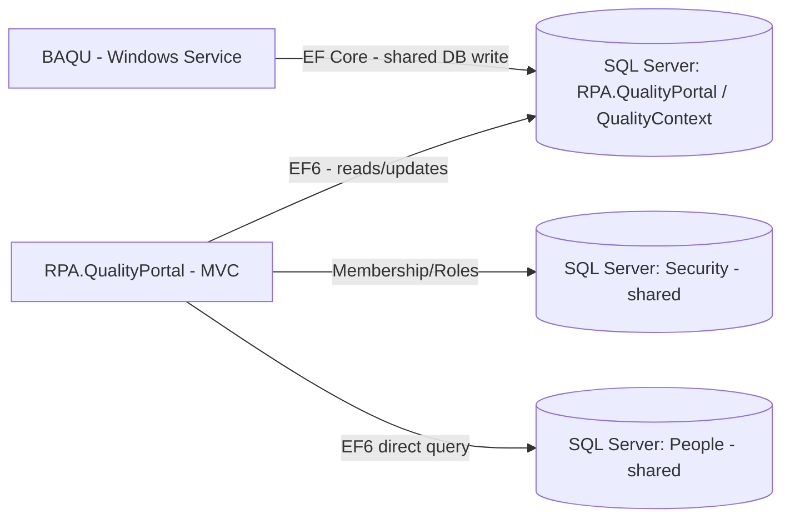

# Assessment - RPA.QualityPortal

## Identification

**Repository Name**: rpa-quality-checks (solution: `RPA.QualityPortal`)
**Type**: Web Application (ASP.NET MVC 5) — the largest and most feature-rich legacy portal in the portfolio
**Language**: C#
**Frameworks**: .NET Framework 4.7.2, ASP.NET MVC 5.2.7, Entity Framework 6.2.0, ASP.NET SQL Membership/Role Provider, EPPlus 4.5.3.2
**Repository URL**: Local clone only — `rpa-quality-checks/`

## Summary
RPA.QualityPortal is the human-facing quality-assurance portal for reviewing and re-checking outbound correspondence and bank account changes across the DEFRA/RPA estate. It has by far the largest controller surface of any app in the portfolio: `Admin`, `Home`, `People`, `BankAccount`, `BankAccountReCheck`, `OutboundCorrespondence`, `OutboundCorrespondenceAccreditation`, `OutboundCorrespondenceMI`, `OutboundCorrespondenceReCheck`, `OutboundCorrespondenceReChecks`. This strongly indicates it is the **downstream review UI for the records that `baqu` creates** — `baqu` writes `QualityCheckDetails` rows (bank account changes) directly into this app's `QualityContext` database, and this portal is where a human reviews/re-checks them (`BankAccountReCheckController`).

It is on the newest .NET Framework version in the legacy estate (4.7.2, vs. 4.5/4.5.2 for its siblings), and shares the same estate-wide "Security" and "People" SQL Server database dependencies.

## Service Dependencies

### Cloud Services (GCP/AWS/Azure)
- None found — on-prem only

### Databases
- **QualityContext** (`RPA.QualityPortal`, local SQL Server `Data Source=.`): primary EF6 application database — **this is the same database `baqu` writes `QualityCheckDetails` into directly** (confirmed cross-repo shared-database coupling)
- **IDTSecurityConnection** (`Security` DB on `D3VMPRWSQL003`): shared authentication/authorization database
- **PeopleContext** (`People` DB on `D3VMPRWSQL003`, connection string includes explicit `encrypt=False;trustservercertificate=False` — notable since these are commonly-flagged insecure TLS settings for SQL Server connections): direct SQL Server access to the shared "People" data domain (same pattern as `rpa-inspections-workbench`/`rpa-mts-inspections`)

### Messaging
- None found

### Storage
- None found beyond standard MVC static assets

### APIs and External Integrations
- **Inbound, not outbound**: this app does not call other services, but it is the **consumer of record** for data written by `baqu` — the two repositories form a producer/consumer pair coupled via a shared SQL Server database rather than an API

### Other Dependencies
- **IDT.Web.Security** (checked-in binary reference, same shared internal library as the other three legacy portal apps — confirmed via shared `IDTSecurityConnection`/RoleManager configuration pattern)
- EPPlus — Excel export (consistent with "MI" — Management Information — reporting implied by `OutboundCorrespondenceMIController`)

## Communication

### Exposed Endpoints
| Method | Path | Description | Authentication |
|--------|------|--------------|-----------------|
| — | `/Admin/*` | Application administration | Membership/Roles (`[Authorize]` confirmed present) |
| — | `/Home/*` | Landing pages | Membership/Roles (`[Authorize]` confirmed present) |
| — | `/People/*` | People/user-related views | Membership/Roles |
| — | `/BankAccount/*` | Bank account records (linked to `baqu`-sourced data) | Membership/Roles |
| — | `/BankAccountReCheck/*` | Human review/re-check workflow for bank account quality checks | Membership/Roles |
| — | `/OutboundCorrespondence/*` | Outbound correspondence records | Membership/Roles |
| — | `/OutboundCorrespondenceAccreditation/*` | Accreditation-related correspondence | Membership/Roles |
| — | `/OutboundCorrespondenceMI/*` | Management information/reporting | Membership/Roles |
| — | `/OutboundCorrespondenceReCheck/*` / `/OutboundCorrespondenceReChecks/*` | Human review/re-check workflow for outbound correspondence | Membership/Roles |

### Consumed Endpoints
- None found

### Asynchronous Communication
- None found at the application-code level — but there is an **implicit, shared-database-based async relationship** with `baqu`: BAQU periodically writes new `QualityCheckDetails` rows that appear in this portal for a human reviewer to action, functioning as a poll-based, database-mediated queue rather than a message broker

### Communication Diagram

## Configuration

### Environment Variables
- None — `Web.config`-based; no per-environment transforms observed for this specific solution's main Web.config in this pass (recommend confirming via a full directory listing before Phase 1 is finalized)

### Configuration Files
- `Web.config`: connection strings (`IDTSecurityConnection`, `QualityContext`, `PeopleContext`), Membership/Profile/RoleManager configuration
- `packages.config`: legacy NuGet dependency pinning

### Secrets and Sensitive Parameters
- SQL connections use Windows Integrated Security — no stored credentials
- `PeopleContext` connection string explicitly sets `encrypt=False;trustservercertificate=False` — **flag as a security hardening item**: TLS encryption for this SQL connection is explicitly disabled, which should be corrected (`encrypt=True`) regardless of migration timeline, and definitely before moving to Azure SQL Database (which requires encrypted connections)

## Infrastructure

### Containerization
- **Dockerfile**: No

### Kubernetes/Helm
- **Manifests**: No

### Infrastructure as Code
- **Terraform/Bicep**: No

### CI/CD
- **Pipeline**: None found specific to this app (only the generic scaffolded workflow files injected by the migration tooling)

## Testing

### Coverage
- Not measured

### Test Types
- **Unit**: Yes — `RPA.QualityPortal.Tests` project exists
- **Integration/E2E**: Not evident

### Observations
Given this app has the largest controller/business-logic surface in the legacy estate, and is the target of a cross-repo shared-database write from `baqu`, test coverage here is especially important to validate before any schema or API-boundary changes are made.

## Points of Attention for Multi-Cloud/Azure Migration

### Cloud-Specific Dependencies
- None (on-prem), but this is the **central hub** of the shared "Security"/"People"/"QualityContext" database coupling across the whole legacy portfolio

### Hardcoded Configurations
- Hardcoded SQL Server hostnames (`D3VMPRWSQL003`)
- Explicit TLS-disabled SQL connection (`encrypt=False`) on `PeopleContext` — security remediation item independent of migration timing

### Legacy Code or Old Patterns
- .NET Framework 4.7.2 + EF6 + ASP.NET MVC 5 — full modernization to .NET 8/10 and EF Core required
- Shared `IDT.Web.Security`/"Security" database dependency — same portfolio-level risk as the other three legacy apps
- **Direct cross-repo database coupling with `baqu`** — this is the most significant architectural finding in the whole portfolio: two independently-deployable-looking repositories (a Windows Service and an MVC web app) share a single SQL Server database and its exact schema. Migrating either one independently without addressing this coupling risks breaking the other.

### Specific Recommendations
1. **Introduce a formal API boundary between `baqu` and `rpa-quality-checks`** (e.g., a `POST /api/quality-checks` endpoint hosted by a modernized `RPA.QualityPortal`, called by `baqu` instead of writing to the database directly) as a prerequisite or fast-follow to modernizing either application — this decouples their release cycles and database schemas.
2. Fix the `PeopleContext` connection string's `encrypt=False;trustservercertificate=False` setting immediately as a security hardening item, independent of the broader migration timeline.
3. Replace direct `PeopleContext` SQL access with calls to `people-api`.
4. Migrate `QualityContext` from EF6 to EF Core targeting Azure SQL Database, coordinating schema ownership with the `baqu` migration since both currently write to/read from the same tables.
5. Coordinate the shared "Security" database / `IDT.dll` migration with the other three dependent legacy apps as a single portfolio-level identity workstream.
6. Given this app's central role (largest controller surface + shared-DB producer relationship with `baqu`), sequence its migration planning immediately after `people-api`'s in the portfolio roadmap, and before the smaller `rpa-cph-non-subsidy`/`rpa-inspections-workbench`/`rpa-mts-inspections` apps if their timelines allow.

## Additional Observations
- This report, combined with the `baqu` report, confirms a **bidirectional, high-priority cross-repo dependency**: `baqu` (producer) → shared `QualityContext` database ← `rpa-quality-checks` (consumer/reviewer UI). This pairing should be treated as a single migration unit/move-group in the portfolio roadmap rather than two independent applications.
